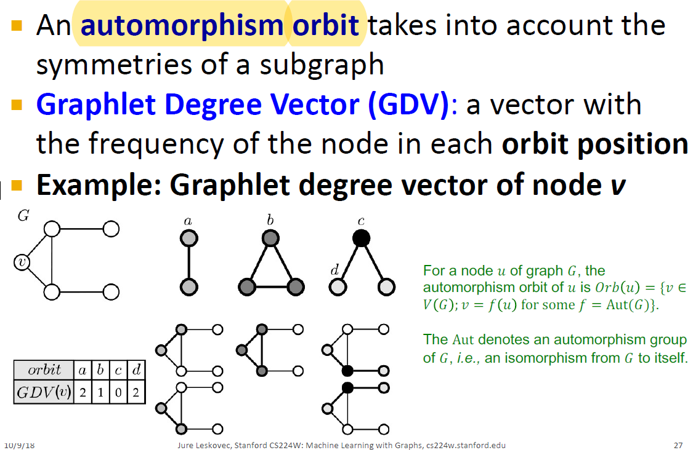

# CS224W-stanford

**同构\(isomorphism\)**

​ 对于图$$G_1, G_2$$, 若存在一个双射$$f:V(G_1)\to V(G_2)$$, 使得对任意的节点对$$u,v\in V(G_1)$$, $\(u,v\)\in E\(G\_1\)\iff\(f\(u\),f\(v\)\)\in E\(G\_2\)$, 则称图$G\_1$与$G\_2$同构. 其中$V\(G\), E\(G\)$分别代表$G$的节点集与边集. 称$f$是$G\_1$到$G\_2$的同构映射\(isomorphism\), 记: $$

**自同构\(automorphism\)**

​ 对于一个图$G$, 若存在一个不为恒等映射的双射$f:V\(G\)\to V\(G\)$, 使得对任意的节点对$u,v\in V\(G\)$, $\(u,v\)\in E\(G\)\iff\(f\(u\),f\(v\)\)\in E\(G\)$, 则称$G$是一个自同构的图

​ 对于图$G$中的一个节点$u$, 定义其**自同构轨迹\(automorphism orbit\)**为:

$$
Orb(u)=\{v\in V(G);v=f(u)\ for\ some\ f=Aut(G)\}
$$

其中$Aut\(G\)$表示$G$到$G$的同构映射集合. 注意: 不同节点的轨迹要么不相交, 要么相同, 因此这些不同的轨迹构成集合$V\(G\)$的一个划分.

**Graphlet Degree Vector\(GDV\)**

非正式地: 给定一个图$G$以及一系列不同构的图案${G_i}_{i=1}^{K}$, 对于$G$中的每个节点$v$, 计算作为不同的角色出现的次数. 例子如下

