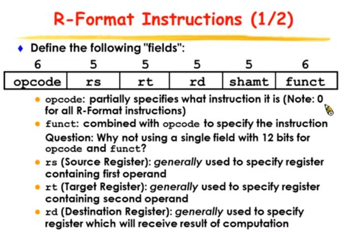

# 计算机组成原理-台湾科技大学CS250

台湾科技大学刘一宇--CS250笔记

## 第1课笔记

performance

Response time: How long it takes to do a task. 完成一个工作所需的时间

Througnput: Total work done per unit time. 单位时间内能完成工作量

|  f = \(g+h\)-\(i+j\) |  add t0, g, h  add t1, i, j  sub f, t0, t1 |
| :--- | :--- |


## 第2课笔记

各种类型ISA \(**I**nstruct **S**et **A**rchitecture\)

出现各式架构的原因在于硬件技术的逐步提升, 下面按时间顺序叙述, MIPS指令集属于Load/Store架构, 从1975年起, 所有的机器都采用GPR架构\(包含Load/Store\)

1.Accumulator

这种架构里, 硬件上只有一个寄存器, 叫做accumulator, 在下面的例子中, `acc`代表这个唯一的寄存器, `mem[A]`表示变量`A`的值

```text
add A    # acc <- acc + mem[A]        (1 address)
addx A    # acc <- acc + mem[A+x]        (1+x address)
```

```text
# C = A + B
load A    # 将A的值放入acc寄存器中
Add B    # 将B的值与寄存器中的值累加, 计算结果存储在acc寄存器中
Store C    # 将acc寄存器中的值放入C中
```

2.Stack

下面的代码中`tos`表示**to**p of **s**tack, 即栈顶元素, 而`next`表示栈顶的下一个元素. \(理解上可以对照使用栈来进行表达式求值的过程\)

```text
add        # tos <- tos + next            (0 address)
```

```text
# C = A + B
Push A    # A的值入栈
Push B    # B的值入栈
Add        # 栈顶部两元素出栈做加法, 将计算结果入栈
Pop C    # 将栈顶元素出栈, 并将值放入C中
```

3.General Purpose Register \(GPR\)

操作数可以在内存或者寄存器中\(reg-mem\)

```text
add A B        # EA(A) <- EA(A) + EA(B)    (2 address)
add A B C    # EA(A) <- EA(B) + EA(C)    (3 address)
```

```text
# C = A + B
Load $r1 A    # 将A的值放入寄存器中
Add $r1 B    # 将B的值与寄存器r1中的值相加, 结果放入r1寄存器内
Store C $r1    # 将r1寄存器的值放入C中
```

4.Load/Store

是GPR的一种变形, 特点是运算的操作数\(operand\)只能在寄存器中, 运算结果也存储在寄存器中, 内存中的数据必须通过`load`放入寄存器后才能计算, 另外需要通过`store`将运算完后的值从寄存器放回到内存中去.

下面代码中`ra`, `rb`, `rc`都是寄存器, `$ra`代表寄存器中的值, `mem[$rb]​`代表内存地址为`$rb`的值.

```text
add        $ra $rb $rc        # $ra <- $rb + $rc
load    $ra $rb            # $ra <- mem[$rb]
store    $ra $rb            # mem[$rb] <- $ra
```

```text
# C = A + B
Load $r1 A
Load $r2 B
Add $r3 $r1 $r2
Store C $r3
```

MIPS指令集

### Register Operands

寄存器

共32个寄存器

* `$0`, ..., `$31`为整数, 每个都是32个bit
  * 其中`$16`, ..., `$22`别名为`$s0`, ..., `$s7`存储C语言里的变量
  * 其中`$8`, ..., `$15`别名为`$t0`, ..., `$t7`存储临时变量
  * 其中`$0`存储常量0, 别名为`$zero`, 此寄存器的值不能被修改

指令集

Notes

* 每条指令都是32个bit
* 每条指令的语法是固定的: 1 operator, 3 operands

  ```text
  add $s0 $s1 $s2        # s0 = s1 + s2
  ```

按指令的存储形式分:

R fomat 指令: 1个运算符, 3个寄存器

I fomat 指令: 1个运算符, 2个寄存器, 1个立即数\(常数\)

J format指令

按指令的功能分:

arithmetic instruction: add/addi, sub, ...

logical instruction: and/andi, or/ori, nor, sll, srl, sra

memory access instruction: lw, sw

其他要点

* 与C语言等高级语言相比较, 汇编语言不使用变量的概念, 替代的是寄存器的概念. 寄存器的个数是少量的, 固定的.
* MIPS指令集把32个bit称为一个word
* 通过以上叙述可知: MIPS的地址空间为32位, 所以是一个32位的系统

### Memory Operands

```text
# load word指令
# operator: lw, operands: t0, 12, s0
lw $t0 12($s0)
```

上述指令表示将`$s0`寄存器的值作为基准地址, 向右偏移12个byte得到的地址, 从这个地址开始的32个bit的内容放入寄存器`$t0`中.

Notes:

`$s0`被称为base register, 12被称为offset, 在MIPS指令集中, 这两个操作数必须分别是寄存器与常数

```text
# store word指令
# operator: sw, operands: t0, 12, s0
sw $t0 12($s0)
```

**字节对齐\(alignment\)**: MIPS指令集要求所有的word被放在内存中时, 起始地址必须是4的整数倍.

MIPS采用Big Endian的方式对进行内存存储: 即最高位放在最左侧, 或者更精确地描述法为: most significant byte = word address.

### Immediate Operands

I format

```text
addi $29 $29 4    # $29 = $29 + 4
slti $8 $18 10
andi $29 $29 6
ori $29 $29 4
```

Note

* 没有subi指令: 使用addi实现

`$zero`寄存器的作用

```text
add $t2 $s1 $zero    # 将$s1寄存器的值存入t2中
```

### Signed and Unsigned Numbers

略\(参见CSAPP笔记\)

补码的优点: 100 -&gt; \[11\]100都表示-4, 小容量转为大容量, 只需复制最高位即可

### Represent Instructions\(待补充\)

ASM\(汇编语言\)不等于Instruction, 中间需要assembler转换

* R-format: for register
* I-format: for immediate, and lw and sw\(因为涉及到了offset\)
* J-format: for dump



opcode与funct共同决定指令是什么

r-format的指令opcode为0, 由funct决定指令是什么.

* 对于普通的R-format指令, shamt=0
* 对于左移或右移指令, shamt存储移动位数\[0, 31\], rs=0.

Notes:

* 特殊的寄存器: Program Counter\(PC\) 程序计数器寄存器, 里面存储了下一条指令在内存中存储的地址, 为了执行下一条语句, 只需要按照PC中的值去查找内存, 读取32个bit, 执行即可. Intel把PC叫做Instruction Address Pointer.

### Logical Operations

shift指令: 是R-format指令, 在指令的表示中shift参数存储在shamt中

注意shift指令虽然是R-format指令, 但操作数为2个register与1个立即数, 其中在指令的表示中, rs=0, rt等于操作数寄存器, rd为运算后的结果存放的寄存器.

shift指令有3种

* sll \(shift left logical\): 逻辑左移: 补0, 对应C语言的左移`<<`
* srl \(shift right logical\): 逻辑右移: 补0
* sra \(shift right arithmetic\): 算术右移: 补最高位的值, 对应C语言的右移`>>`

```text
sll $t2 $s0 4
```

logical operations

按位与/或/异或

* and, or, nor: R-format
* abdi, ori: I-format, 但是I-format里只有16位存储立即数, 所以只会截取最低的16位. 另外这16位采用0填充的方法.

### Decision Making and Branches

### 杂录

code density是什么?

most significant byte: 高位

