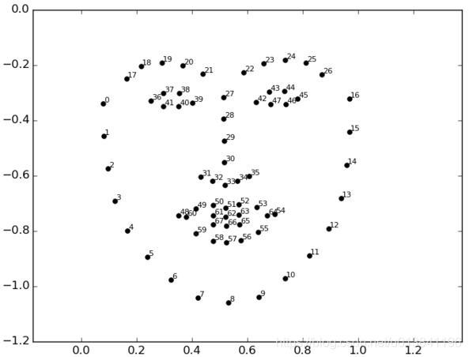

### COCO 标注格式

[参考链接](https://www.immersivelimit.com/tutorials/create-coco-annotations-from-scratch)

coco的目标检测任务的标注文件仅为一个json文件（含有所有图片的标注），形式如下：

```json
{
	"info": ... // 整个数据集的一些信息, 用处不大
	"licenses": ... // 数据所用到的开源协议列表, 不同图片的开源协议可能不一样
	"categories": ... // 数据里所有的物体种类
	"images": ... // 每张图片的基本信息
	"annotations": ... // 标注
}
```

**info**

```json
"info": {
    "description": "COCO 2017 Dataset",
    "url": "http://cocodataset.org",
    "version": "1.0",
    "year": 2017,
    "contributor": "COCO Consortium",
    "date_created": "2017/09/01"
},
```

**license**

```json
"licenses": [
    {
        "url": "http://creativecommons.org/licenses/by-nc-sa/2.0/",
        "id": 1,
        "name": "Attribution-NonCommercial-ShareAlike License"
    },
    {
        "url": "http://creativecommons.org/licenses/by-nc/2.0/",
        "id": 2,
        "name": "Attribution-NonCommercial License"
    },
    ...
] // 一共有9种许可证
```

**categories**

```json
"categories": [
	{"supercategory": "person", "id": 1, "name": "person"},
  	{"supercategory": "vehicle", "id": 2, "name": "bicycle"},
  	...
],  // 一共有80种类别, 但id存在间段的情况
```

**images**

```json
"images": [
    {
        "license": 4,
        "file_name": "000000397133.jpg",
        "coco_url": "http://images.cocodataset.org/val2017/000000397133.jpg",
        "height": 427,
        "width": 640,
        "date_captured": "2013-11-14 17:02:52",
        "flickr_url": "http://farm7.staticflickr.com/6116/6255196340_da26cf2c9e_z.jpg",
        "id": 397133  // 与filename没有必要一致
    },
    {
        "license": 1,
        "file_name": "000000037777.jpg",
        "coco_url": "http://images.cocodataset.org/val2017/000000037777.jpg",
        "height": 230,
        "width": 352,
        "date_captured": "2013-11-14 20:55:31",
        "flickr_url": "http://farm9.staticflickr.com/8429/7839199426_f6d48aa585_z.jpg",
        "id": 37777
    },
    ...
]
```

**annotations**

```json
"annotations": [
    {
        "segmentation": [[510.66,423.01,511.72,420.03,...,510.45,423.01]],  // 多边形的标注方式
        "area": 702.1057499999998,
        "iscrowd": 0,
        "image_id": 289343,
        "bbox": [473.07,395.93,38.65,28.67], // 左上角的宽，左上角的高，宽，高
        "category_id": 18,
        "id": 1768
    },
    ...
    {
        "segmentation": {
            "counts": [179,27,392,41,…,55,20], // RLE 的标注方式
            "size": [426,640]
        },
        "area": 220834,
        "iscrowd": 1,
        "image_id": 250282,
        "bbox": [0,34,639,388],
        "category_id": 1,
        "id": 900100250282
    }
]
```

annotations 是一个列表，每个列表代表一个标注（即一个物体）。各字段的含义为

- segmentation：表示实例分割标签，标注形式后面再详述。
- area：物体的面积
- iscrowd：若取值为 1 表示该条标注为一群物体，标注形式为 RLE 格式，会采用这种标注形式的例子为：叠在一起的书本，人群；若取值为 0 ，则表示该条标注代表一个轮廓清晰的物体，标注形式为多边形格式。
- image_id：图片ID，与 images 中的 id 字段相对应
- bbox：目标检测标签，四个数字依次代表：左上角的 $$x$$ 坐标，坐上角的 $$y$$ 坐标，目标框的宽，目标框的高。其中 $$x$$ 轴代表图片的上边缘，$$y$$ 轴代表图片的左边缘，原点位于左上角，四个数字均为绝对坐标（像素个数），但可能会有小数出现。
- category_id：物体类别，与 categories 中的 id 字段对应
- id：标注唯一性标识，无具体含义

注意：

- 标注信息均为像素位置的绝对值，注意像素位置，面积等标注信息可以是小数。
- annotations 列表是无序的，即同一张图片里的实例标注信息在 annotations 列表中不一定是连续的

实例分割标签分为两种：

- `iscrowd=0`：表示该实例为单个物体，segmentation 字段为一个列表，列表中的每个元素代表着一个多边形。例如：

  ```json
  {
  	"segmentation": [
  			[2, 134, 100, 134, 100, 200, 50, 270, 2, 200],
  			[102, 134, 150, 200, 102, 200]
  		]  // 连续的两个数字为一组代表一个顶点的坐标
  }
  ```

  代表该物体由一个凹五边形与一个三角形构成：

  ```
  (x, y)
  [(2, 134)->(100, 134)->(100, 200)->(50, 270)->(2, 200)->(2, 134)]
  [(102, 134)->(150, 200)->(102, 200)->(102, 134)]
  ```

- `iscrowd=1`：表示该实例为一群物体，segmentation 字段形式如下，counts 为 RLE 格式的mask。

  ```
  {
      "segmentation": {
      "counts": [0,179,27,392,...,41,55,20],
      "size": [240, 320]
  },
  ```

  `size` 字段表示 `[height, width]`，表示图片大小（该标注对应图片大小），而 `counts` 字段表示逐像素的 mask，mask 的形状为 `[height, width]`（在这个例子中为 `[240, 320]`），mask 为 1 表示该像素值属于物体，mask 为 0 表示该像素不属于物体。`counts` 的具体含义为：将 mask 拉直后（按列的方式拉直，即先取第一列，紧接着取第二列，以此类推），依次出现了 0 个 0，179 个 1，27 个 0，392 个 1 等等。

  备注：counts 的第一个元素一定是数有多少个 0，counts 的长度可以是奇数也可以是偶数，因此 counts 的最后一个元素可能是数有多少个 0，也可能是数有多少个 1。一个简易的转换代码如下：

  ```python
  def coco_mask2rle(mask):
      # mask (np.array): (height, width)
      # returns: rel (list)
      cur, count, rle = 0, 0, []
      for _ in mask.transpose().reshape(-1):
          if _ != cur:
              rle.append(count)
              count, cur = 1, _
          else:
              count += 1
      rle.append(count)
      return rle
  ```

一个简易的标注可视化代码参见 [show_mask.py](../.gitbook/assets/coco/show_mask.py)。（仅供理解，不要重复造轮子:blush:）

#### pycocotools

**安装**

linux参考[官方源码](https://github.com/cocodataset/cocoapi)的说明即可。

windows 下需要安装第三方改写的包，如下：

```
pip install git+https://github.com/philferriere/cocoapi.git#subdirectory=PythonAPI
```

**简介**

```python
# image_id: 图像id, cat_id: 类别id, anno_id: 标注id 
class COCO: #全部函数如下
	def __init__(self, annotation_file=None):
		# 大体上是读取标注文件
        # ...
        self.createIndex()
    def createIndex(self):
        # 建立索引, 无返回
        pass
    def info(self):
        # 打印"info", 无返回
        pass
    def getAnnIds(self, imgIds=[], catIds=[], areaRng=[], iscrowd=None):
        # imgIds为指定的图像id列表, catIds为指定的标签id列表, areaRng为最小的面积阈值, iscrowd用于指定只返回iscrowd=0或1的标注
        # 返回满足条件的anno_id列表
    def getCatIds(self, catNms=[], supNms=[], catIds=[]):
        # 在json的categories字段中筛选: catNms用于指定"name"列表, supNms用于指定"supercategory"列表, catIDs用于指定"id"列表
        # 返回满足条件的cat_id列表
    def getImgIds(self, imgIds=[], catIds=[]):
        # 至少有catIds中的至少一个类别的imgIds中的图片
        # 返回满足条件的image_id列表
    def loadAnns(self, ids=[]):
        # ids表示anno_id列表，用于返回这些标注信息
        # 返回例子为：
        """
        [{"segmentation": [...], "bbox": [...], "id": 111, area": 112.32, ...},
        {"segmentation": [...], "bbox": [...], "id": 1123, "area": 1121.32, ...},
        ...]
        """
    def loadCats(self, ids=[]):
        # ids表示cat_id列表，用于返回类别信息
        # 返回例子为：
        """
        [{"id": 1, "name": "car", "supercategory": "car"},
        {"id": 2, "name": "cat", "supercategory": "animal"},
        ...]
        """
    def loadImgs(self, ids=[]):
        # ids表示image_id列表，用于返回图像信息
        # 返回例子为：
        """
        [{"id": 1, "file_name": "000100.jpg", "height": 100, "width": 120, ...},
        {{"id": 23, "file_name": "0001100.jpg", "height": 110, "width": 320, ...}},
        ...]
        """
    def showAnns(self, anns, draw_bbox=False)
    	"""作图: 不会读取相应的图片, 只对标注区域打阴影, 无返回值"""
    def loadRes(self, resFile):
        """待补充"""
    def download(self, tarDir = None, imgIds = [] ):
        # 下载数据
    def loadNumpyAnnotations(self, data):
        """
        Convert result data from a numpy array [Nx7] where each row contains {imageID,x1,y1,w,h,score,class}
        :param  data (numpy.ndarray)
        :return: annotations (python nested list), 例子：
        
        [{
            'image_id'  : imageID,
            'bbox'  : [x1, y1, w, h],
            'score' : score,
            'category_id': class,
        }]
        """
    def annToRLE(self, ann):
        """待补充"""
    def annToMask(self, ann):
        """待补充"""
```

## PIL

```python
from PIL import Image
im = Image.open("./temp.jpg")
# print(im.format, im.size, im.mode)  # im.size=(width, height)
im_arr = np.array(im)
im_arr.shape  # (height, width)
im_arr.dtype  # np.uint8
out_im = Image.fromarray(im_arr.astype(np.uint8))  # 注意必须先转为像素值在0~255之间的uint8类型才能转换为Image对象
out_im.save("1.jpg")
```

PIL 默认的图像格式为 RGB，图像形状为 (H, W, 3)

CV2 默认的图像格式为 BGR，图像形状为 (H, W, 3)

mxnet 默认的图像读取格式为 RGB，图像形状为 (H, W, 3)

pytorch 默认的图像格式（网络输入）为 RGB，形状为 (B, 3, H, W)

tensoflow 默认的图像格式（网络输入）为 RGB，形状为 (B, H, W, 3)

### LFW 数据集

> ​       LFW数据集共有13233张人脸图像，每张图像均给出对应的人名，共有5749人，且绝大部分人仅有一张图片。每张图片的尺寸为250X250，绝大部分为彩色图像，但也存在少许黑白人脸图片。
> ​       LFW数据集主要测试人脸识别的准确率，该数据库从中随机选择了6000对人脸组成了人脸辨识图片对，其中3000对属于同一个人2张人脸照片，3000对属于不同的人每人1张人脸照片。测试过程LFW给出一对照片，询问测试中的系统两张照片是不是同一个人，系统给出“是”或“否”的答案。通过6000对人脸测试结果的系统答案与真实答案的比值可以得到人脸识别准确率
> ————————————————
> 版权声明：本文为CSDN博主「姚路遥遥」的原创文章，遵循CC 4.0 BY-SA版权协议，转载请附上原文出处链接及本声明。
> 原文链接：https://blog.csdn.net/Roaddd/article/details/114221618

### Megaface 数据集

**测试方法**

Cumulative Match Characteristics (CMC) curve：将待

#### 人脸关键点

参考链接：[CSDN](https://blog.csdn.net/u013841196/article/details/85720897)



68 个关键点如上图所示，转换为 5 个关键点的方式为

```python
landmark5[0] = (landmark68[36] + landmark68[39]) / 2  # 右眼
landmark5[1] = (landmark68[42] + landmark68[45]) / 2  # 左眼
landmark5[2] = landmark68[30] # 鼻子
landmark5[3] = landmark68[48] # 右嘴角
landmark5[4] = landmark69[54] # 左嘴角
```

### insightface

`recognition/_tools_/mask_renderer.py`：自动生成口罩遮挡的人脸

训练/验证数据集：

例如：faces_umd.zip

```
agedb_30.bin  # 1:1的验证数据（训练时使用）
cfp_fp.bin
lfw.bin
property  # 类别数, 112, 112
train.idx  # 索引,train.rec中哪些byte是一个图片
train.rec  # mxnet二进制文件,包含图片及类别
```


测试数据集

例如：IJBC

```
IJBC 
    - loose_crop
        - xxx.jpg  # 1.jpg~469375.jpg
    - meta
        - ijbc_face_tid_mid.txt  # 469375行
        - ijbc_name_5pts_score.txt  # 469375行
        - ijbc_template_pair_label.txt  # 15658489行
```

ijbc_face_tid_mid.txt 文件内容解释：第一项为图片名，第二项表示该图片是哪个人，第三个数字是视频 ID。注意：同一个人可能有多个ID，例如

```
1.jpg 1 69544
2.jpg 1 3720
...
469375.jpg 187955 111105
```

ijbc_name_5pts_score.txt 文件内容解释：第一项为文件名，后面连续 10 个浮点数两个一组分别为 5 个关键点的 $$(x,y)$$ 绝对像素位置坐标，最后一个数字是一个接近 1 的分数（该图片是人脸的置信度）

ijbc_template_pair_label.txt 文件内容解释：前两个为人物 ID，如前面所述，两个 ID 可能对应的是同一个人，由第三个数字指示。

```
1 11065 1
1 11066 1
...
171707 185794 0
```

不同的人物 ID 数有 23124 个，但不同的 ID 有可能对应到同一个人。并且人物 ID 与视频 ID 都**不是**从 1 开始连续编号。

#### IJBC 测试数据集

每个 ID 对应多张图片，每个人物对应多个 ID。测试时判断两个 ID 是否是同一个人。测试标签例子如下：

```
person_id_1	person_id_2	1  // 表示这两个ID是同一人
person_id_3	person_id_4	0  // 表示这两个ID不是同一人
```

范式如下：训练一个网络，输入是人脸图片，输出是一个 512 维的特征。测试时，将所有属于同一个 person_id 的图片的输出特征取平均。对于每一条测试数据，求两个 person_id 对应特征的余弦距离，设定一个阈值来判断这两个 person_id 是否为同一个人。


度量指标

1: 1 验证：

- ROC & TAR@FAR

$$
TAR=\frac{TP}{TP+FN}=\frac{TP}{P}\\
FAR=\frac{FP}{FP+TN}=\frac{FP}{N}
$$

一般而言，负样本对的数目会比较大，因此 FAR 会很小，性能指标会使用 TAR@FAR 的形式表示：通过调整阈值，使得 FAR 值达到指定的要求，统计此时的 TAR，例如：$$0.95@10^{-6}$$，表示调整相似度阈值使得 FAR 为 $$10^{-6}$$ 时，TAR的值为 0.95。备注：随着阈值的提升，TAR 与 FAR 同时下降。

另一种度量指标是对不同的相似度阈值描点：`(FAR, TAR)`，得到 ROC 曲线，计算 ROC 曲线下的面积。

LFW 准确率评估指标：将测试数据分为 K 组，每次选择其中一个组调整阈值使得准确率最高，在剩余的 K-1 个组上计算准确率。对每个组重复上述操作，得到均值与方差，例如：$$0.95\pm0.01$$。

1: n 识别：

Megaface 比赛评测方法：

使用 K 张图片做为底库（gallery set），测试样本为 N 个人物，每个人 M 张图片，这里 $$N=80, M=50, K=10^6$$，这 $$N\times M$$ 张图片称为 probe set。gallery set 中没有这 N 个人物的图片，每次测试都将一个人的一张照片放入到 gallery set 中，用剩余的 M-1 张图片与 $K+1$ 张图片计算相似度并排序，判断与这张图片的相似度大小是否排在 Rank-K 以内。


实验记录：

Probe set （facescrub）图片数量：不到 4000 张

MegaFace Gallery set 未去噪前图片数量：1027058
