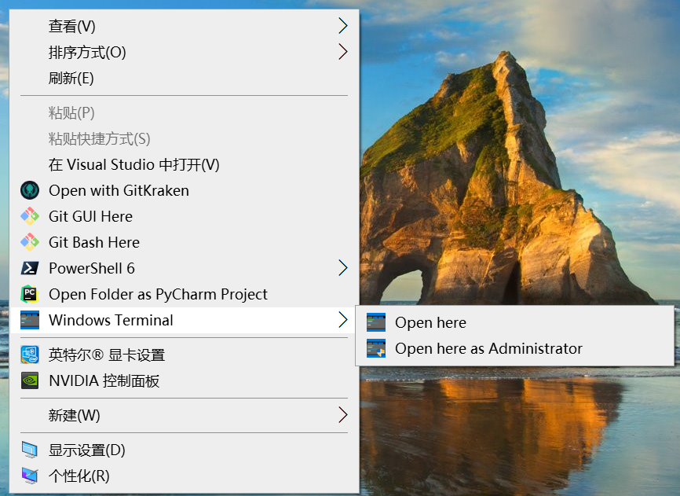

# draft

## 提问方式

有时候搜索一些奇怪的语法搜索引擎支持的不好，尽量用一句完整的话来搜索：

```
what is ${@:2} in shell
```

## Latex/Markdown

### 0.记号约定

以下参考《统计推断》--George Casella，《几何与代数》--胡国权，《神经网络与深度学习 》--邱锡鹏

markdown语法仅用到{\bf X}。字体仅用到大小写字母斜体与大小写字母正粗体。

**概率统计**

|                                  |                     |
| -------------------------------- | ------------------- |
| $X$                              | 随机变量            |
| $x$                              | 样本/随机变量的取值 |
| ${\bf X}=(X_1,X_2,\ldots,X_p)^T$ | 随机向量            |
| ${\bf x}=(x_1,x_2,\ldots,x_p)^T$ | 样本/随机向量的取值 |
|                                  |                     |

$L(\theta,{\bf x})$

$P(X=x),P({\bf X}={\bf x})$

$f_X(x),f_{\bf X}({\bf x})$

**线性代数**

|          |      |
| -------- | ---- |
| $A$      | 矩阵 |
| $\bf{x}$ | 向量 |
| $x$      | 标量 |
| $\bf{A}$ | 张量 |
|          |      |

**机器学习**

遵从线性代数的记号（矩阵向量标量张量）（仅用于暗示维度，其他不做任何约定）

例如：样本矩阵记作$A\in\mathbb{R}^{n\times p}$或者$A\in\mathbb{R}^{p\times n}$
彩色图片记作${\bf A}\in\mathbb{R}^{a\times b\times c}$
彩色图片集合记作${\bf A}\in\mathbb{R}^{a\times b\times c\times n}$

注意到维数较高的张量的记号还是会引起混淆，故可仅使用${\bf A}$表示三维张量，更高维可换其他记号。

注记：上述记号约定中大写字母的记号有冲突，但不至于引起混淆，所用的符号类型仅有4种，便于临时约定其他符号。

### 1.代码与对应的效果

$xy,\boldsymbol{xy},{\bf xy},XY,{\bf XY},\boldsymbol{XY}$

## 常用软件

7-zip、Adobe Reader、typora、notepad++、Git

VSCode、XShell、Xftp、Anaconda

Make、CMake、MinGW

## VSCode 使用大杂烩

### VSCode 离线安装扩展


### VSCode 设置项

VSCode设置`File->Preferences->Settings`中的`用户`优先级低于`工作区`再低于文件夹, 实际上三者的可以设置的参数名是相同的. 优先级会决定哪个发挥作用. _**也许逻辑是这样的, 用户的设置会体现在vscode安装目录下, 三者计算的结果会存在当前工作区的.vscose目录下**_. 有关于python的默认参数及含义可参见[官网链接](https://code.visualstudio.com/docs/python/settings-reference)

### VSCode写C++代码\(Window MSVC\)

```text
// tasks.json 注意链接外部头文件的写法
{
    "version": "2.0.0",
    "tasks": [
      {
        "type": "shell",
        "label": "cl.exe build active file",
        "command": "cl.exe",
        "args": [
          "/I",
          "C:/Users/54120/Documents/code",
          "/Zi",
          "/EHsc",
          "/Fe:",
          "${fileDirname}\\${fileBasenameNoExtension}.exe",
          "${file}"
        ],
        "problemMatcher": ["$msCompile"],
        "group": {
          "kind": "build",
          "isDefault": true
        }
      }
    ]
  }
// launch.json
{
    // Use IntelliSense to learn about possible attributes.
    // Hover to view descriptions of existing attributes.
    // For more information, visit: https://go.microsoft.com/fwlink/?linkid=830387
    "version": "0.2.0",
    "configurations": [
        {
            "name": "cl.exe - Build and debug active file",
            "type": "cppvsdbg",
            "request": "launch",
            "program": "${fileDirname}\\${fileBasenameNoExtension}.exe",
            "args": [],
            "stopAtEntry": true,
            "cwd": "${workspaceFolder}",
            "environment": [],
            "externalConsole": false,
            "preLaunchTask": "C/C++: cl.exe build active file"
        }
    ]
}
// c_cpp_properties.json
{
    "configurations": [
        {
            "name": "Win32",
            "includePath": [
                "${workspaceFolder}/**",
                "C:/Users/54120/Documents/code"
            ],
            "defines": [
                "_DEBUG",
                "UNICODE",
                "_UNICODE"
            ],
            "windowsSdkVersion": "10.0.18362.0",
            "compilerPath": "C:/Program Files (x86)/Microsoft Visual Studio/2019/Community/VC/Tools/MSVC/14.28.29333/bin/Hostx64/x64/cl.exe",
            "cStandard": "c17",
            "cppStandard": "c++17",
            "intelliSenseMode": "msvc-x64"
        }
    ],
    "version": 4
}
```

## 术语

CLI \(command-line interface\) 命令行接口

wildcards 通配符

## Linux动态链接库搜索规则
参考 [csdn博客](https://blog.csdn.net/winycg/article/details/80572735)

默认动态链接库的访问使用缓存机制，存放在 `/etc/ld.so.cache` （二进制格式），搜索路径保存在 `/etc/ld.so.conf` 中。当安装了其他的动态链接库时，需要使用 `ldconfig` 命令更新。

## 关于机器的进程数

```bash
$ cat /proc/cpuinfo | grep "physical id" | sort| uniq | wc -l  #  多少个物理cpu
2
$ cat /proc/cpuinfo | grep "core id" | sort| uniq | wc -l  # 每个物理cpu上多少个核
14
$ cat /proc/cpuinfo | grep "processor" | sort| uniq | wc -l  # 多少个逻辑cpu
56
```

现代 CPU 的每个核一般都支持超线程。因此：
$$
逻辑CPU数=物理CPU数*每个CPU的核数*每个核支持的超线程数
$$

```bash
$ lscpu
Architecture:          x86_64
CPU op-mode(s):        32-bit, 64-bit
Byte Order:            Little Endian
CPU(s):                56		// 逻辑CPU数
On-line CPU(s) list:   0-55		// 每个逻辑CPU的编号
Thread(s) per core:    2		// 每个核的超线程数
Core(s) per socket:    14		// 每个CPU的核数
Socket(s):             2		// 物理CPU数
...
```

逻辑 CPU 数即为该机器并行的最大线程数。

在 Python 中，可以使用如下两种方式得到逻辑 CPU 数。（参考 Pytorch Dataloader 源码）

```python
import os
os.sched_getaffinity(0)  # 获取与进程号为0的进程的亲和CPU编号集合,适用于linux
os.cpu_count()  # 逻辑CPU数，适用于OSX,Windows,linux
```

## pdf 格式

bitmap, image, raster graphics：都指的是以像素点的像素值进行存储的图片

verctor graphics: 翻译为矢量图或位图，是电脑图形

pdf 的基本元素为

- 字符（单个字符及相应的位置）
- 位图（电脑图形）
- 图片
- 多媒体数据（例如动图）
- 其他（超链接，Javascript，form）

## 配置文件格式（待补充）

### json

### yaml

```python
import yaml
with open('test.yaml', 'r') as f:
    config = yaml.load(f, Loader=yaml.SafeLoader)
```

**特殊语法**

```yaml
name: &NAME abc
book: *NAME
```

`&NAME` 表示后面的内容 `abc` 为“变量” `NAME`，而 `*NAME` 表示引用变量 `NAME` 的值。

```
name: abc
book: abc
```

一个[例子](https://github.com/VITA-Group/DeblurGANv2/blob/master/config/config.yaml)（节选）：

```yaml
---
project: deblur_gan
experiment_desc: fpn

train:
  files_a: &FILES_A /datasets/my_dataset/**/*.jpg
  files_b: *FILES_A
  size: &SIZE 256
  crop: random
  preload: &PRELOAD false
  preload_size: &PRELOAD_SIZE 0
  bounds: [0, .9]
  scope: geometric
  corrupt: &CORRUPT
    - name: cutout
      prob: 0.5
      num_holes: 3
      max_h_size: 25
      max_w_size: 25
    - name: jpeg
      quality_lower: 70
      quality_upper: 90
    - name: motion_blur
    - name: median_blur
    - name: gamma
    - name: rgb_shift
    - name: hsv_shift
    - name: sharpen

val:
  files_a: *FILES_A
  files_b: *FILES_A
  size: *SIZE
  scope: geometric
  crop: center
  preload: *PRELOAD
  preload_size: *PRELOAD_SIZE
  bounds: [.9, 1]
  corrupt: *CORRUPT
```


### xml

### ini

## cuda版本问题

```text
nvidia-smi  # CUDA Drive Version
nvcc -V  # CUDA Runtime Version
```

CUDA 提供了两套 API，一套是 CUDA Driver API，另一套是 CUDA Runtime API，其中 Driver API 更为底层。

```
import torch
torch.version.cuda()  # Runtime version
```

一般而言，只需要关注 Runtime API 即可，例如在 Linux 系统中的 `~/.bashrc` 中添加这几行（添加到 PATH 与 LD_LIBRARY_PATH 尤为重要）指的是 Runtime API 相关的路径。

```
export CUDA_HOME=/usr/local/cuda-10.0
export PATH=$PATH:$CUDA_HOME/bin
export LD_LIBRARY_PATH=$LD_LIBRARY_PATH:$CUDA_HOME/lib:$CUDA_HOME/lib64
```


## gitbook/gitbook.com/github page/Read the Docs

gitbook是用来制作书籍的软件. 为此需要先安装node.js, 之后安装gitbook CLI, 然后编写书籍的内容\(一堆markdown文件\), 之后利用安装好的gitbook来编译, 运行. 这样就可以启动一个本地服务, 就看到书籍了

gitbook.com是gitbook CLI的网页版, 也是官方现在维护的版本. 使用方式为首先在gitbook.com上注册一个账号, 在账号内新建一个空间, 之后在空间里添加笔记, 最终可以在类似如下网址看到创建的书籍网页

```text
https://buxianchen.gitbook.io/notes/
```

github page为个人创建网页的过程是: 在github上建立一个特殊的仓库, 仓库名为

```text
<username>.github.io
```

之后在这个仓库里按普通仓库一样的方式添加文件, 最终可以在类似于

```text
https://buxianchen.github.io/
```

的网页看到创建的结果, github page可以为个人/组织/项目来创建

可以将gitbook编译后的东西放入github上的仓库, 从而形成页面

Read the Docs可以[参考](https://blog.csdn.net/lu_embedded/article/details/109006380)

计划:

* 使用github.io\(github page\)写零散的博客\(暂无计划\)
* ~~使用Read the Docs写代码文档或书~~\(页面结构似乎只能有两层\)
* gitbook.com与github仓库关联\(写完整的笔记\), 持续更新\(页面结构似乎只能有两层\)

## `~/.ssh` 目录

目录结构

```
authorized_keys  # 将其他机器的公钥写入此文件中, 则其他机器可以ssh免密登录
id_rsa  # 本机私钥
id_rsa.pub  # 本机公钥
known_hosts
```

用途

- 为本机生成 `id_rsa` 与 `id_rsa.pub` 备用

- 将本机的 `id_rsa.pub` 的内容追加到服务器特定用户的 `~/.ssh/authorized_keys` 文件内，可以实现本机到服务器的远程免密登录

  - 本地 Shell 连接服务器无需输入密码。`ssh username@ip_addr`，例如：`ssh foo@172.16.83.43`
  - VScode 远程连接无需输入密码

- 将本机的 `id_rsa.pub` 的内容在 gitlab 或 github 上添加到 SSH Keys 中，则可以免密使用 ssh 进行仓库克隆、推送等操作，例如：

  ```
  git clone git@github.com:BuxianChen/notes.git
  ```

  但对 http 的方式无效，如果使用下面的方式进行 clone，在执行 push 的时候，会自动跳出一个弹出框，要求输入 github 的帐号及密码：

  ```
  git clone https://github.com/BuxianChen/notes.git
  ```

备注：要实现远程免密登陆，服务器端 `.ssh` 文件夹的权限应该为 `700`，而 `authorized_keys` 文件的权限应为 `600`

## 自定义右键菜单栏

备注：win10系统

1. 打开注册表：`win`+`R`，输入`regedit`
2. 点开如下目录：`计算机\HKEY_CLASSES_ROOT\Directory\Background\shell`
3. 
| 注册表目录 | 描述 |
| :--- | :--- |
| `计算机\HKEY_CLASSES_ROOT\Directory\shell\typora` | 右击目录时显示在菜单栏 |
| `计算机\HKEY_CLASSES_ROOT\*\shell\typora` | 右击文件是显示在菜单栏 |
| `计算机\HKEY_CLASSES_ROOT\Directory\Background\shell`\ | 点击空白位置显示在菜单栏 |
| `计算机\HKEY_CLASSES_ROOT\Directory\ContextMenus\` | 点击空白位置显示在菜单栏的次级目录 |



[Windows Terminal](https://github.com/microsoft/terminal/blob/master/doc/user-docs/UsingCommandlineArguments.md)

## subderivative/subgradient

https://en.wikipedia.org/wiki/Subderivative

对于一个定义在开凸集上的凸函数$f:\mathbb{R}^n\to\mathbb{R},dom(f)=U$，设$x_0$是$U$的内点（因为$U$是开集，所以这里的内点相对于$U$或$\mathbb{R}^n$两者含义相同），$f$在$x_0$处的次导数（subgradient）是满足下述条件的向量$v$集合:
$$
f(x)-f(x_0)\ge v^T(x-x_0)\quad\forall x\in U
$$
注记：在$x_0$处可微时，上述集合是单点集，即为普通的梯度。注意区分上述定义与凸函数的定义。这个定义的一个用途是找极值点。

一般函数（不必是凸的）的定义：待补充

## 回归问题中$R^2$的定义

设${y_i}_{i=1}^N$为真实值，${\hat{y}_i}_{i=1}^N$为模型输出的预测值。

$$
\bar{y}=\frac{1}{N}\sum_{i=1}^N{y_i}\\
SS_{total}=\sum_{i=1}^{N}{(y_i-\bar{y})^2}\\
SS_{res}=\sum_{i=1}^{N}{(y_i-\hat{y}_i)^2}\\
R^2=1-\frac{SS_{res}}{SS_{total}}
$$

$R^2$的取值范围为$\(-\infty, 1\]$。越大越好，最佳为1。一个baseline为$\hat{y}\_i\equiv\bar{y}$，此时$R^2=0$。但可能会有模型预测结果的$R^2$为负值。

## 长尾分布\(幂律分布\)

长尾分布又称为幂律分布, 即分布函数存在不可忽略的尾巴\(非指数\). 可能会引起无限方差或均值\(猜测准确说是相应的无穷限积分不是绝对收敛的, 故方差和期望没有定义\), 严格定义待补充.

典型地: 正态分布**不是**长尾分布

在机器学习或其他领域中, 由于长尾分布的尾巴部分不可忽略, 但出现频率较低, 出现样本稀疏的情况, 不利于

## Windows 10应用商店Ubuntu 18.04 LST

```text
# 查看显卡型号
lshw -c video
```

## Windows操作系统搜索命令的顺序

先搜索当前目录，再搜索PATH

ipconfig命令的目录在`C:\Windows\System32`

## SVD++\(不完善\)

论文题目: \(2008\)Factorization meets the neighborhood: a multifaceted collaborative filtering model.

问题背景: 给用户做商品推荐, 具体来说, 假定有$n$个用户, $m$种商品, 用户对商品的兴趣矩阵记作$R\in\mathbb{R}^{n\times m}$, 其中$R$的某些位置的元素是已知的, 但有些位置的元素是未知的.\($r_{ij}\in\[0,1\]$, $r_{ij}$越大表示兴趣度越高\), 目标是填补矩阵$R$的空白元素, 从而起到推荐的效果. 具体来说优化问题定义为:

$$
\min_{\{p_i\},\{q_j\}} \sum_{(i,j)\in\mathcal{K}}{(r_{ij}-q_i^Tp_j)^2}+\lambda(\|q_i\|_2^2+\|p_j\|_2^2)
$$

其中$\mathcal{K}$表示已知的评分对, $q\_i$与$p\_j$分别表示用户$i$与商品$j$的向量表示.

具体应用时, 对上述目标还可以加入先验知识进行改进, 例如: 有些用户给分标准偏高, 某些物品得分偏低. 引入$b\_i\in\mathbb{R}$与$c\_j\in\mathbb{R}$表示这种偏见, 将优化目标改为

$$
\min_{\{p_i\},\{q_j\}} \sum_{(i,j)\in\mathcal{K}}{(r_{ij}-q_i^Tp_j-b_i-c_j-\mu)^2}+\lambda(\|q_i\|_2^2+\|p_j\|_2^2+\|b_i\|_2^2+\|c_j\|_2^2)
$$

其中$\mu$为评分的均值. 上述打分标准的思想为: 打分=兴趣+偏见.

\(SVD++\)更进一步, 还可以加入更多的先验信息, 思想为: 打分=兴趣+偏见+隐式反馈. 其中隐式反馈可以代表点击次数, 浏览历史等, 即:

$$
\hat{r}_{ij}=\mu+b_i+c_j+q_j^T(p_i+\frac{1}{|N(i)|^{1/2}}\sum_{k\in N(i)}y_k)
$$

其中$N\(i\)$表示用户$i$的行为集合\(浏览过哪些商品\), $y\_k$代表该行为表达的隐式反馈\(猜想应该是事先定义好的规则, 例如浏览时间越长, $y\_i$越大\). 实现代码可去github上搜索即可.

## graphviz安装

**step 1**: 首先下载安装程序[https://graphviz.org/download/](https://graphviz.org/download/)

**step 2**: 将graphviz的`bin`目录加入系统PATH环境变量

**step 3**: 在python环境中

```text
pip install graphviz
```

**\*step 4**: 如果还出错, 尝试降低graphviz版本:

```text
dot -v
dot -c
```

## Windows命令行

```text
# 以下注释前面全部带两个空格
where activate  # 查找某个exe文件或.bat文件的位置
start task.bat  # 启动批处理脚本文件
type nul > c.txt  # 创建空文件
type c.txt  # 显示文件内容
echo a > a.txt  # 重写一个文件(若a.txt不存在, 则创建它)
echo ads >> c.txt  # 追加字符(并自动加上一个换行符)
del a.txt  #
rmdir /s /q <目录名>  # /s用来删除非空目录, 但会有确认的提示信息, /q表示安静模式, 取消确认的提示信息
mkdir <目录名>  # 创建空目录
D:  #切换盘符
cmd /K activate cuda10.1  # K: keep?运行后保持
cmd /C activate cuda10.1  # C: close?运行后关闭
cmd /K start test.bat
cmd /C start test.bat
set  # 查看所有环境变量
set homepath  # 查看homepath环境变量
set path = "D:\"  # 设置path环境变量的值, 注意只在当前cmd窗口中有效
set path = %path%;D:\  # 追加, 注意只在当前cmd窗口中有效
cd ss & cd .. & echo a  # &是连接符, 这样就可以在一行中写下多条命令

# 注意以下语句运算符前后可以加空格
set /a a = 1 + 3
set /a b = 1
set /a a + b
```

### shell脚本

实际上就是一条条可以在cmd中直接运行的命令, 保存为`.cmd`或`.bat`文件, 有两种启动方式

1\) 双击该文件. 这种方式会新开一个命令窗口，运行结束后新开的命令窗口会自动关闭

2\) 在cmd窗口中使用`start xx.bat`命令. 这种方式会新开一个命令窗口, 运行结束后新开的窗口会被保留

```text
# @表示不显示命令本身, 只输出运行结果
@echo asd
# 表示这条语句之后的命令均不被显示, 但注意echo off本身会被显示
echo off
# echo off语句本身也不被显示在屏幕上
@echo off
# 注意等号前后不要留空, 等号前不留空是为了能正常赋值(命令行模式下空格被用作了分割符), 等号后不留空的原因是为了避免赋值的内容意外多一个空格.另外注意字符串不用加双引号, 否则双引号本身也会成为赋值内容的一部分
set x=abc sd
echo x: %x%
pause
```

关于快捷方式, `右键->属性->目标`, `右键->属性->起始位置`. 可以通过`win+R`直接运行目标内的内容

### Powershell脚本

.psl文件: PowerShell脚本文件

## 修改物理地址\(危险操作\)

公司外网电脑

原始物理地址: 00E17C688E5C `控制面板->网络和Internet->网络连接->右键以太网2->属性->配置->高级->Network Address` 将值修改为: 00E17C688E6C

可以尝试在百度搜索引擎中输入ip查看当前ip.

## 数据库（可能会弄错MySQL与PostgreSQL）

语法实例

```sql
-- hello world
select * from tablename
-- 统计整个表的行数
select count(*) from tablename
-- 统计某列非空值的行数
select count(colname) from tablename
```

实际使用例子

注意: 左/右连接慎用

```sql
SELECT * from innovation.temp_gaf_graph_facebook_id_z order by facebook_id OFFSET 124008 limit 3;

SELECT * from innovation.temp_gaf_graph_facebook_id_z order by facebook_id OFFSET 124010 limit 4;

SELECT * from innovation.temp_gaf_graph_facebook_id_z order by facebook_id limit 10;

SELECT COUNT(fb_id) FROM base.base_04_facebook_post_incre
WHERE fb_id IN (SELECT DISTINCT facebook_id FROM innovation.temp_gaf_graph_facebook_id_z) GROUP BY fb_id ORDER BY fb_id OFFSET 10 limit 2;

SELECT COUNT(fb_id) FROM base.base_04_facebook_post_incre
WHERE fb_id IN (SELECT DISTINCT facebook_id FROM innovation.temp_gaf_graph_facebook_id_z) GROUP BY fb_id ORDER BY fb_id OFFSET 9 limit 3;

--计算innovation.temp_gaf_graph_facebook_id_z表中的用户的发帖数量
SELECT accountID, COUNT(unique_id) FROM (
SELECT id_table.facebook_id accountID, post_table.post_content post_content, post_table.post_create_time msgDate, post_table.table_source, post_table.id unique_id
FROM innovation.temp_gaf_graph_facebook_id_z id_table LEFT OUTER JOIN base.base_04_facebook_post_incre post_table ON (
id_table.facebook_id = post_table.fb_id)) AS joint_table GROUP BY accountID ORDER BY accountID;

"""SELECT * FROM (
            SELECT id_table.facebook_id accountID, post_table.post_content post_content, post_table.post_create_time msgDate, post_table.table_source, post_table.id unique_id
            FROM (SELECT * from innovation.temp_gaf_graph_facebook_id_z ORDER BY facebook_id offset {} limit {}) AS id_table
            LEFT OUTER JOIN
            base.base_04_facebook_post_incre post_table ON (id_table.facebook_id = post_table.fb_id)
            ) AS joint_table ORDER BY accountID;""".format(offset, limit)
```

## C/C++知识编译补充

[load-time dynamic loading与load-time dynamic loading](https://stackoverflow.com/questions/2055840/difference-between-load-time-dynamic-linking-and-run-time-dynamic-linking)

## gcc编译选项

问题来源: OpenKE中的一条编译指令

```text
g++ ./base/Base.cpp -fPIC -shared -o ./release/Base.so -pthread -O3 -march=native
```

* `-fPIC`, `-shared`选项表示生成动态链接库
* `-o`选项表示指定输出文件名, 疑惑的是为什么没有按照`libxxx.so`命名
* `-O3`选项是指定编译时进行优化, 可参考[知乎](https://www.zhihu.com/question/27090458)
* `-march=native`

## boost安装\(VS2019\)

将压缩文件`boost_1_74_0.zip`解压后进入\(使用x86\_x64 Cross Tools Command Prompt for VS 2019命令行\)

```text
bootstrap.bat
.\b2
```

对需要使用boost的项目`项目->属性->VC++目录`添加路径

```text
# 包含目录增加
D:\boost_1_74_0
# 库目录增加
D:\boost_1_74_0\stage\lib
```

## gcc升级

参照[这个](https://itbilu.com/linux/management/V1vdnt9ll.html)后

```bash
rm -rf /usr/bin/gcc
ln -s /usr/local/bin/gcc /usr/bin/gcc
```

## graphviz安装

**windows安装**

**step 1**: 首先下载安装程序[https://graphviz.org/download/](https://graphviz.org/download/)

**step 2**: 将graphviz的`bin`目录加入系统PATH环境变量

**step 3**: 在python环境中

```text
pip install graphviz
```

**\*step 4**: 如果还出错, 尝试降低graphviz版本:

```text
dot -v
dot -c
```

## 多示例学习\(Multiple-instance Learning\)

简单地说, 标注数据是模糊的\(例如: 在一段视频中, 只要有一帧出现了气球, 就给整个视频打上气球的标签\)

## transduction与induction

有疑惑可以搜索维基与知乎, 以下为一些解释

* transduction表示训练时已经见过了需要测试的数据。常见的情形有
  * 聚类\(给定一些数据, 任务是对这些数据划分为不同的簇, **但不要求做以下任务: 新来一个样本, 判断其簇的归属问题**\); 
  * 半监督学习情况下，训练集为$\mathcal{D}={\mathbf{X}_{tr},\mathbf{y}_{tr},\mathbf{X}_{un}}$，另有数据集$\mathbf{X}_{te}$。假设目前的任务是对$\mathbf{X}_{un}$预测标签，那么它是一个transductive semi-supervised learning；如果任务是预测$\mathbf{X}_{te}$的标签，则它是一个induction semi-supervised learning
* induction表示通过训练数据总结一般的规律，每来一个新的数据就可以利用这个规律进行预测。常见的有：
  * 监督学习

## C++整数除法

C++整数除法总是向零取整, %运算符的结果满足`被除数=商*除数+余数`.

```cpp
#include <iostream>
#include <random>
using namespace std;
int main()
{
    default_random_engine e;//随机数生成器
    e.seed(0);
    const int n = 20;
    const int m = 10;
    for (int i = 0; i < n; i++)
    {
        //e()返回值为unsigned int类型
        int s1 = e() % 2 * 2 - 1;
        int s2 = e() % 2 * 2 - 1;
        int a = s1*(e() % m + 1);
        int b = s2*(e() % m + 1);
        cout << a << "/" << b << "=" << a / b << "\t"
            << a << "%" << b << "=" << a % b << "\t"
            << "a%b + (a/b)*b==a?" << (a % b + (a / b)*b == a) << endl;
    }
    system("pause");
    return 0;
}
```

```cpp
//const int 与 int const两种写法含义相同.
int const *p = &a //不能通过*p修改a的值,无论a是否为const类型
int * const p = &a //不能修改p的指向
//int const * const p 与 const int * const p含义相同
```

## C/Python/np/tf/pytorch数据类型对照表

| C | 字节数\(C\) | python 3.7.4 | numpy 1.17 | torch 1.3.0 |
| :--- | :--- | :--- | :--- | :--- |
| bool |  | bool | numpy.bool | torch.bool |
| int | 4 | int | numpy.int32\(1 default\) | torch.int32 or torch.int |
| double | 8 | float | numpy.float64\(1. default\) | torch.float64 or torch.double |
| float | 4 | - | numpy.float32 | torch.float32 or torch.float \(1. default\) |
| long long | 8 | - | numpy.int64 | torch.int64 or torch.long \(1 default\) |
| unsigned char | 1 | - |  | torch.uint8 |
| char | 1 | - |  | torch.int8 |
| short \[int\] | 2 | - |  | torch.int16 or torch.short |
| unsigned short \[int\] | 2 | - |  | - |
| unsigned \[int\] | 4 | - |  | - |
| \[signed\] long \[int\] | 4 | - |  | - |
| unsigned long \[int\] | 4 | - |  | - |
|  |  |  |  | torch.float16 |
|  |  |  |  |  |
|  |  |  |  |  |

## numpy/pytorch/tensorflow常用接口对照

| numpy | torch | tensorflow |
| :--- | :--- | :--- |
| max/min \(参数: axis\) | max/min \(参数: dim\) |  |
| maximum/minimum | max/min |  |
| ndarray.astype\(类型转换\) | ndarray.to\(类型转换\) |  |
| ::-1/flip\(数组负数步长切片\) | flip\(tensor负数步长切片\) |  |
| reshape | reshape/view |  |
| copy | clone/copy_/detach/detach\_ |  |
| concatenate\(已有维度\)/stack\(新维度\) | cat/stack |  |
| 数组下标的数据类型int32等 | int64等\(不能为int32\) |  |
| transpose\(颠倒多个维度\) | permute\(颠倒多个维度\) |  |

## pytorch.utils.checkpoint?\(已弃用?\)

pytorch 的 checkpoint 是一种用时间换显存的技术，一般训练模式下，pytorch 每次运算后会保留一些中间变量用于求导，而使用 checkpoint 的函数，则不会保留中间变量，中间变量会在求导时再计算一次，因此减少了显存占用，跟 tensorflow 的 checkpoint 是完全不同的东西。

[https://blog.csdn.net/ONE\_SIX\_MIX/article/details/93937091](https://blog.csdn.net/ONE_SIX_MIX/article/details/93937091)

## 目标检测相关论文调研

ImageNet的图像分类任务

1000类，共1200\*1000张图片，50,000张验证图片，150,000张测试图片。

torchvision.ops中内置有nms, rol\_pooling等操作

| 论文 | 年份 | 类别 | 说明 |
| :--- | :--- | :--- | :--- |
| Alexnet | 2012 | 分类 | ImageNet 2012冠军\(分类任务\) |
| ZFnet | 2013 | backbone | ImageNet 2013分类任务冠军 |
| Overfeat | 2013 | backbone | ImageNet 2013定位任务冠军 |
| VGG | 2014 | backbone | ImageNet 2014第二名 |
| NIN | 2014 |  | Network in Network, 1\*1 conv |
| GoogLenet | 2014 | backbone | ImageNet 2014第一名, 1\*1conv |
| HighwayNet | 2015.5 |  |  |
| Resnet | 2015.12 | backbone | ImageNet 2015 |
| Wide Resnet | 2016.5\(arxiv\) |  |  |
| DenseNet | 2016.8\(arxiv\) |  | CVPR 2017, dense connect Net |
| MobileNet v1 | 2017.4\(arxiv\) |  | MobileNet v2\(2018.1 arxiv\) |
| SENet | 2017.9\(arxiv\) |  | ImageNet 2017 |
|  |  |  |  |
| SIFT | 2004 |  | 尺度不变特征 |
| selective search | 2011- | proposal region | 非深度方法 |
| EdgeBox | 2014\(ECCV\) | proposal region |  |
|  |  |  |  |
| Adam | 2014.12\(arxiv\) | 优化算法 |  |
|  |  |  |  |
| RCNN | 2013.10\(arxiv\) | 目标检测 | bounding box regression |
| SPPnet | 2014.6\(arxiv\) | 分类，目标检测等 | 提到卷积层可以适应任意大小输入, 大概早于ImageNet 2014, SPP层用于输出固定维数特征 |
| FCN | 2014.11\(arxiv\) | 语义分割 | CVPR 2015 best paper提名 |
| FastRCNN | 2015.4\(arxiv\) | 目标检测 | ROI-pooling |
| FasterRCNN | 2015.6\(arxiv\) | 目标检测 | RPN层替换掉原来的selective search等方法 |
| Yolo v1 | 2015.6\(arxiv\) | 目标检测 | first one-stage detector in deep learning era |
| SSD | 2015.12\(arxiv\) | 目标检测 | one-stage detector |
| Yolo v2 | 2016.12\(arxiv\) | 目标检测 |  |
| Yolo v3 | 2018.4\(arxiv\)? | 目标检测 |  |
| Mask RCNN | 2017.3\(arxiv\) | 实例分割 | ROI-align |
| FPN | 2016.12\(arxiv\) | 目标检测 |  |
|  |  |  |  |
|  |  |  |  |
|  |  |  |  |
|  |  |  |  |
|  |  |  |  |
|  |  |  |  |

训练数据（有无数据增强），测试数据。另外VOC数据集还有difficult的问题。以VOC数据集为例，2007与2012都有train, val, test数据

[https://arleyzhang.github.io/articles/1dc20586/](https://arleyzhang.github.io/articles/1dc20586/)

**论文中针对 VOC2007和VOC2012 的具体用法有以下几种：**

* 只用VOC2007的trainval 训练，使用VOC2007的test测试
* 只用VOC2012的trainval 训练，使用VOC2012的test测试，这种用法很少使用，因为大家都会结合VOC2007使用
* 使用 VOC2007 的 train+val 和 VOC2012的 train+val 训练，然后使用 VOC2007的test测试，这个用法是论文中经常看到的 07+12 ，研究者可以自己测试在VOC2007上的结果，因为VOC2007的test是公开的。
* 使用 VOC2007 的 train+val+test 和 VOC2012的 train+val训练，然后使用 VOC2012的test测试，这个用法是论文中经常看到的 07++12 ，这种方法需提交到VOC官方服务器上评估结果，因为VOC2012 test没有公布。  
* 先在  MS COCO 的 trainval 上预训练，再使用 VOC2007 的 train+val、 VOC2012的 train+val 微调训练，然后使用 VOC2007的test测试，这个用法是论文中经常看到的 07+12+COCO 。 
* 先在  MS COCO 的 trainval 上预训练，再使用 VOC2007 的 train+val+test 、 VOC2012的 train+val 微调训练，然后使用 VOC2012的test测试 ，这个用法是论文中经常看到的 07++12+COCO，这种方法需提交到VOC官方服务器上评估结果，因为VOC2012 test没有公布。   

在各自数据集上分别进行建模和评测的用法比较少，基本上在早期论文里出现就是起个对照作用；现在的大部分论文都会为了增加数据量而将二者合起来使用。

t-sne: [http://www.datakit.cn/blog/2017/02/05/t\_sne\_full.html](http://www.datakit.cn/blog/2017/02/05/t_sne_full.html)

注: t-sne只能用作fit-transform, 而不能用作先fit再transform. 简单来说, t-sne的目标是将高维向量降低至2维或3维, 保持高维空间的向量的相似度关系, 这种相似度关系利用概率分布来体现, 损失是利用KL散度迫使高维空间的分布与低维空间一致. 缺陷是新来的样本没有办法进行降维.

spatial transform networks: [https://kevinzakka.github.io/2017/01/10/stn-part1/](https://kevinzakka.github.io/2017/01/10/stn-part1/)

注: 简单来说, 假设某层的输入为$X\in\mathbb{R}^{H,W,C}$, STN会使用$X$得到6个参数, 使用这6个参数对$X$进行仿射变换得到$X'\in\mathbb{R}^{H',W',C}$, 其中$H’，W'$为网络超参数, 而后利用正常的卷积:$Y=f\_{conv}\(X'\)$, 其中$Y$为下一层的输入.

## windows设置软件快捷方式

右键启动软件的图标，选择属性-&gt;快捷方式`ctrl+alt+C`

## windows快捷键

`Win + Tab`：切换应用窗口。用`方向键`选择，`Enter`确定。（会显示历史窗口）

`Alt + Tab`：切换应用窗口。按住`Alt`键，用`Tab`选择，松开`Alt`键确定。

## windows terminal使用

增加shell: [参考](https://dev.to/azure/easily-add-anaconda-prompt-in-windows-terminal-to-make-life-better-3p6j)

快捷键:

`Ctrl+Alt+数字`切换打开的控制台 `ctrl+shift+数字`打开新的控制台\(参见windows terminal的设置栏\) `shift+alt+=/+`横向打开新控制台 `shift+alt+_/-`纵向打开新控制台 `alt+方向键`在本标签页内切换控制台 `ctrl+shift+w`关闭当前控制台

\[toc\]

## 翻译软件/工具/模型

常见的翻译工具/软件有: 谷歌翻译, 百度翻译, 有道翻译, 微软翻译

翻译模型

## 颜色值的表示

对照表详情参见[wiki](https://en.wikipedia.org/wiki/Web_colors)

```text
#FF0000  -- (255, 0, 0) -- Red(红色)
#00FF00  -- (0, 255, 0) -- Green(绿色)
#0000FF  -- (0, 0, 255) -- Blue(蓝色)
```

## C/C++动态分配内存

```c
void *calloc(size_t nitems, size_t size)  // nitems:元素个数, size:元素大小, 分配后此内存块会赋上初始值0
```

```c
void *malloc(size_t size)  // size: 字节数, 分配的内存不会初始化为0
```

## 一个积分计算

$$
G(x,D)=cx+b[D-x]_++h[x-D]_+\\
目标----g(x):=E_D[G(x,D)]\\
g(x)=g(0)+\int_0^{x}g'(z)dz\\
g(0)=E_D[G(0,D)]=E_D[bD]=bE_D[D]\\
g(z)=E_D[cz+b[D-z]_++h[z-D]_+]\\
\frac{d}{dz}{\int_{c(z)}^{d(z)}g(x,z)dx}=g(d(z),z)d'(z)-g(c(z),z)c'(z)+\int_{c(z)}^{d(z)}\frac{\partial g(x,z)}{\partial z}dx\\
\frac{d}{dz}E_D[[D-z]_+]=\frac{d}{dz}\int_z^{+\infty}p(D)(D-z)dD=-p(z)(z-z)+\int_z^{+\infty}{-p(D)}dD\\
\frac{d}{dz}E_D[[z-D]_+]=\frac{d}{dz}\int_{-\infty}^zp(D)(z-D)dD=p(z)(z-z)+\int_{-\infty}^z{p(D)}dD\\
g'(z)=-b(1-F(z))+hF(z)\\
g(x)=bE[D]+\int_0^{x}g'(z)dz=bE[D]-bx+(b+h)\int_0^{x}F(z)dz\\
$$

## TODO: 潜在狄利克雷分配\(LDA: Latent Dirichlet Allocation\)

输入一堆文档, 其中每个文档指的是一个词语列表. 输出一个文档-话题矩阵与一个话题-词语矩阵, 其中每个文档的所有话题相加等于1, 每个话题的所有词语相加等于1

## softplus函数

$$
\text{softplus}(x)=\zeta(x)=\log(1+\exp(x))
$$

$\(-\infty,+\infty\)\to\(0,+\infty\)$, 可以看作是对$\text{relu}\(x\)=\[x\]\_+=\max\(0,x\)$的软化, 但需要较大的计算量.

## 资源描述框架\(RDF: Resource Description Framework\)

RDF中有三类"东西": IRI\(International Resource Identifiers, 类似于URI\), blank nodes, literals\(字面量\), 其中知识用

$$
Subject-Predicate->Object
$$

来描述, 简称SPO. 其中S可以是IRI或者blank node, P是IRI, O三种都可以. 因此字面量只能充当叶子节点.

参考链接: [http://www.ruanyifeng.com/blog/2008/02/rdf.html](http://www.ruanyifeng.com/blog/2008/02/rdf.html)

RDF的基本思想很简单, 就是说任何网络资源都可以唯一地用URI\(统一资源标识符，Uniform Resource Identifier\)来表示. 在这里, 可以简化地将URI理解成网址URL. 比如Yahoo, 首页的网址是[http://www.yahoo.com/](http://www.yahoo.com/), 那么它的首页就可以用这个网址来唯一代表. 有了这个识别符以后，网络资源的其他特性都用"属性\(Property\)"="属性值\(Property value\)"这样的形式来表示.

根据RDF的定义, 资源本身是主语\(subject\), 属性名称是谓语\(predicate\), 属性值是宾语\(object\). RDF本身用xml文件表示, 下面是两个例子

例子1\(简化后不规范的xml文件\)

```markup
<?xml version="1.0"?>

<RDF>
<Description about="http://www.yahoo.com/">
<资源作者>Yahoo！公司</资源作者>
<资源名称>Yahoo！首页</资源名称>
</Description>
</RDF>
```

例子2\(\)

```markup
<?xml version="1.0" encoding="utf-8"?>

<rdf:RDF xmlns:rdf="http://www.w3.org/1999/02/22-rdf-syntax-ns#"
xmlns:trackback="http://madskills.com/public/xml/rss/module/trackback/"
xmlns:dc="http://purl.org/dc/elements/1.1/">
<rdf:Description
rdf:about="http://www.ruanyifeng.com/blog/2006/02/post_179.html"
trackback:ping="http://www.ruanyifeng.com/cgi-bin/mtype/mt-tb.cgi/251"
dc:title="学科和采矿"
dc:identifier="http://www.ruanyifeng.com/blog/2006/02/post_179.html"
dc:subject="History"
dc:description="今天突然想到一个比喻：选择不同的学科就好像采矿一样。 有的矿是新发现的矿物品种，埋藏浅，品味高，容易开采。选择这样的矿，很容易出成果。某些新兴学科大概就是这样的矿，计算机科学可以算一个例子。..."
dc:creator="ruanyf"
dc:date="2006-02-25T20:52:32+08:00" />
</rdf:RDF>
```

这是一个规范的xml文件，可以实际使用。请注意标成黑体的那几行。首行"rdf:Description"，这是RDF规定使用的标签，表示主语subject，后来的"rdf:about"属性用来表示资源的标识符，也就是url，它唯一地确定了一个网络资源。其他属性中的dc:title、dc:identifier、dc:subject、dc:description、dc:creator和dc:date，分别表示题目、标识符、主题、简介、创造者、日期，这几项都属于都柏林核心，等号后面是相应的值。至于trackback:ping属性，这一项在都柏林核心中没有规定，但是也可以加上去，从中可以看到RDF资源描述框架的灵活和强大。

都柏林核心\(Dublin Core\): 描述网络资源的一些常用的谓词\([参考博客](http://www.ruanyifeng.com/blog/2007/03/dublin_core.html)\)

## C++重写/重载/覆盖

**override\(覆盖\)**: 基类函数带有显式或隐式的`virtual`, 子类中定义一个函数名与参数列表与之完全一致的函数, 则基类中的函数被覆盖. 即无法通过任何方式通过子类访问基类的该函数.

**overwrite\(重写\)**:

* 子类中定义了一个与父类函数名与参数列表完全相同的函数, 但子类函数不是虚函数\(不带显式或隐式的`virtual`\)
* 与父类函数名相同, 但参数列表不相同

以上两种情况均为重写, 即需要通过`sub_class_obj.Base::foo()`方式进行函数调用

**overload\(重载\)**

在同一作用域内\(例如一个类内\), 函数名相同, 参数列表不完全相同, 构成重载.

## 收藏夹里吃灰的开源项目

| 序号 | 描述及链接 | 状态 | 记录时间 |
| :--- | :--- | :--- | :--- |
| 1. timm | [pytorch-image-models](https://github.com/rwightman/pytorch-image-models): CV领域的SOTA backbone | 持续更新中 | 2021-03-02 |
| 2. pytorch-lighting | [PyTorchLightning](https://github.com/PyTorchLightning/pytorch-lightning): 待调研, 似乎是用于将Pytorch代码规范化 | 持续更新中 | 2021-03-11 |
| 3. bert4keras | [bert4keras](https://github.com/bojone/bert4keras): 用几个文件实现transformer的代码, 长期维护, 兼容Keras与TensorFlow 1或2 | 持续更新中 | 2021-03-10 |
| 4. OfficeToPDF | [OfficeToPDF](https://github.com/cognidox/OfficeToPDF): Office系列套件的文件转换为pdf格式, 纯C\#实现. 可惜对于`.vsdx`文件需要电脑上安装了visio | 不更新 | 2021-03-11 |
| 5.triNNity | [triNNity](https://www.scss.tcd.ie/~andersan/projects/live/triNNity.html): C++实现了80种卷积运算 | 持续更新中 | 2021-3-20 |
| 6. fairseq | [fairseq](https://github.com/pytorch/fairseq): 序列模型包\(github pytorch组织下的项目, 由facebook维护\) | 持续更新中 | 2021-3-22 |
| 7. tesseract | [tesseract](https://github.com/tesseract-ocr/tesseract)是一个开源的OCR引擎, [videorc](https://github.com/apm1467/videocr)是一个从视频中获得字幕的包, 依赖于前者 | 持续更新中\(39.6k star\) | 2021-4-15 |
| 8. pdfkit | [wkhtmltopdf](https://wkhtmltopdf.org/downloads.html)是一个将html转换为pdf的库, [pdfkit](https://pypi.org/project/pdfkit/)是一个基于它的python包 | 几乎不更新 | 2021-4-20 |

## 收藏夹里吃灰的网络文档

| 序号及链接 | 描述 | 记录时间 |
| :--- | :--- | :--- |
| 1. [python-packaging](https://python-packaging-zh.readthedocs.io/zh_CN/latest/about.html) | python项目打包 | 2021-4-1 |
| 2. [texample/tikz](https://texample.net/tikz/examples/all/) | latex作图包tikz例子 | 2021-4-14 |
|  |  |  |

## 一些野博客,包,工具

| 序号及链接 | 描述 | 记录时间 |
| :--- | :--- | :--- |
| 0. [https://spaces.ac.cn/](https://spaces.ac.cn/) | 科学空间\(苏建林\), 一些关于AI尤其是NLP相关的博客值得一看, 特点是数学味道比较浓. 但实际上, 工程实践上也很细致 | 2021-6-2 |
| 1. [http://pelhans.com/tags/](http://pelhans.com/tags/) | 一些笔记包含PRML、Python-Cookbook等 | 2021-4-13 |
| 2. [https://carsondb.gitee.io/animeBoard](https://carsondb.gitee.io/animeBoard) | 一个用于做录制视频时ppt自动进行动画播放的工具 | 2021-4-13 |
| 3. [https://www.ics.uci.edu/~eppstein/161/](https://www.ics.uci.edu/~eppstein/161/) | 一门算法课程\(附有很多python实现代码, 但似乎没有上课视频\), CS161好像确实是一门stanford推荐的算法课程, 但不是这个网址 | 2021-4-14 |
| 4. dash\(plotly\) | python模块, 可以生成交互式数据可视化Web应用, 基于 Flask \(Python\) + React 的 web 框架, 其中dash基于plotly | 2021-5-7 |
| 5. pyecharts |  | 2021-5-7 |
| 6. [http://www.ruanyifeng.com/blog/developer/](http://www.ruanyifeng.com/blog/developer/) | 阮一峰的博客 | 2021-6-2 |
| 7. [骏马金龙 (junmajinlong.com)](https://www.junmajinlong.com/) | 博客（包含Python、Linux等系列博客）、博客园排名前两百 | 2021-9-12 |

## Linux操作手册

```text
ls --format single-column openke/base/
# outputs: (垂直方式列出文件)
Base.cpp
Corrupt.h
Random.h
Reader.h
Setting.h
Test.h
Triple.h
```

## 杂录

### callback

callback函数: call back意指"回电话". 例子: 在编写一个对数组排序的函数时, 需要传入一个元素比较函数\(这个比较函数就是callback function\): 以下引用自algs4 part1 第二周ppt

**Callback = reference to executable code.**

* Client passes array of objects to sort\(\) function.
* The sort\(\) functioncallback calls back object's compareTo\(\) method as needed

**Implementing callbacks.**\(不同编程语言如何实现回调函数\)

* Java: interfaces.
* C: function pointers.
* C++: class-type functors.  --- \(例如std::qsort函数的元素比较参数传入的是一个重载了圆括号运算符的类\)
* C\#: delegates.
* Python, Perl, ML, Javascript: first-class functions.  --- \(当函数可以作为别的函数的参数, 即函数可以当作变量一样用时, 称这门语言拥有头等函数, 即first-class function\)

### OpenCL, OpenGL, OpenAL

* OpenCL \(Open Computing Language\): 一个为异构平台编写程序的框架，此异构平台可由[CPU](https://zh.wikipedia.org/wiki/CPU)、[GPU](https://zh.wikipedia.org/wiki/GPU)、[DSP](https://zh.wikipedia.org/wiki/數位訊號處理器)、[FPGA](https://zh.wikipedia.org/wiki/FPGA)或其他类型的处理器与硬件加速器所组成
* OpenGL \(Open Graph Library\): 是用于[渲染](https://zh.wikipedia.org/wiki/渲染)[2D](https://zh.wikipedia.org/wiki/二维计算机图形)、[3D](https://zh.wikipedia.org/wiki/三維計算機圖形)[矢量图形](https://zh.wikipedia.org/wiki/矢量圖形)的跨[语言](https://zh.wikipedia.org/wiki/程式語言)、[跨平台](https://zh.wikipedia.org/wiki/跨平台)的[应用程序编程接口](https://zh.wikipedia.org/wiki/应用程序编程接口)（API）
* OpenAL \(Open Audio Library\): 是[自由软件](https://zh.wikipedia.org/wiki/自由軟體)界的跨平台音效[API](https://zh.wikipedia.org/wiki/API)。它设计给多通道三维位置音效的特效表现。其API风格模仿自[OpenGL](https://zh.wikipedia.org/wiki/OpenGL)。

### C++ AMP, CUDA C, OpenCL

[参考野博客](https://www.infoq.cn/article/cpp-amp)

三者都可用于GPU并行计算

* C++ AMP \(C++ Accelerated Massive Parallelism\): 跨GPU种类\(只要支持[DirectX 11](https://en.wikipedia.org/wiki/DirectX)\), 只适用于windows
* OpenCL: 跨GPU种类, 跨操作系统\(windows/linux\)
* CUDA C: 只适用于Nvidia GPU, 跨操作系统\(windows/linux\)

