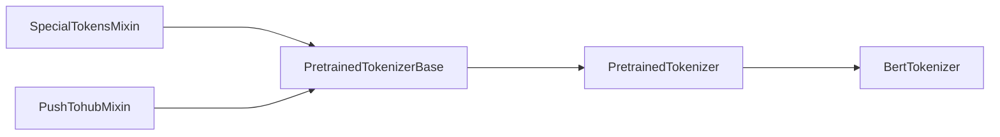

huggingface 的几个重要项目

- transformers
- datasets
- tokenizers
- accelerate
- huggingface-hub
- evaluate
- gradio: 一个适用于AI模型做demo的简易前端

# transformers 包

## 整体代码结构

构建模型主要的基类如下

- `PreTrainedModel`: 模型
- `PretrainedConfig`: 配置
- `PreTrainedTokenizerBase`: tokenizer

在以上三个类之上, `Pipeline` 基类用于组合这三个类.

另外, 还有些小东西: `ModelOutput`, 是模型输出的结果的基类.

`transformers` 的代码总体遵循的[设计哲学](https://huggingface.co/docs/transformers/v4.22.1/en/philosophy)是不强调代码复用, 比如没有一个 `attention.py` 文件中实现所有的注意力机制, 与之相对应的是将所有的模型基本上写在三个文件里, 例如在 `transformers/models/bart` 文件夹里与 `pytorch` 有关的代码文件如下:

```
modeling_bart.py
configuration_bart.py
tokenizer_bart.py
```


## PreTrainedModel

### 使用

```python
pretrained_model_name_or_path = "fnlp/bart-base-chinese"
from transformers import BertTokenizer, BartForConditionalGeneration, Text2TextGenerationPipeline
tokenizer = BertTokenizer.from_pretrained(pretrained_model_name_or_path)
model = BartForConditionalGeneration.from_pretrained(pretrained_model_name_or_path)
text2text_generator = Text2TextGenerationPipeline(model, tokenizer)  
text2text_generator("北京是[MASK]的首都", max_length=50, do_sample=False)
# output:
# [{'generated_text': '北 京 是 中 国 的 首 都'}]
```

### 源码解析

transformers 代码中的带有 `from_pretrained` 的类都继承自 `PreTrainedModel`, 其具体继承关系如下:

```python
class ModuleUtilsMixin:
    pass
    # (@staticmethod) def _hook_rss_memory_pre_forward
    # (@staticmethod) def _hook_rss_memory_post_forward
    # def add_memory_hooks
    # def reset_memory_hooks_state
    # def invert_attention_mask
    # def get_extended_attention_mask
    # def get_head_mask
    # def _convert_head_mask_to_5d
    # def num_parameters
    # def estimate_tokens
    # def floating_point_ops
    # (@property) device
    # (@property) dtype

class GenerationMixin:
    pass
    # ===========
    # public methods:
    # ===========
    # @torch.no_grad()
    # def generate
    # def greedy_search
    # def sample
    # def beam_search
    # def beam_sample
    # def group_beam_search

class PushToHubMixin
    pass
    # ===========
    # public methods:
    # ===========
    # def push_to_hub

class PreTrainedModel(nn.Module, ModuleUtilsMixin, GenerationMixin, PushToHubMixin):
    # ...
    @classmethod
    def from_pretrained(
        cls,
        pretrained_model_name_or_path: Optional[Union[str, os.PathLike]],
        *model_args,
        **kwargs):

        ...
        model = cls(config, *model_args, **model_kwargs)
        ...
        return model
        
    # def save_pretrained
```

### example: BartForConditionalGeneration

具体到上面的例子中:

```python
# transformers/models/bart/modeling_bart.py
class BartPretrainedModel(PreTrainedModel):
    # some class attributes, ...
    def _init_weights(self, module):
        # pass ...
    def _set_gradient_checkpointing(self, module, value=False):
        # pass ...

class BartModel(BartPretrainedModel):
    # 具体的模型定义...
    def __init__(self, config: BartConfig):
        super().__init__(config)

        padding_idx, vocab_size = config.pad_token_id, config.vocab_size
        self.shared = nn.Embedding(vocab_size, config.d_model, padding_idx)

        self.encoder = BartEncoder(config, self.shared)  # 继承自BartPretrainedModel
        self.decoder = BartDecoder(config, self.shared)  # 继承自BartPretrainedModel

        # Initialize weights and apply final processing
        self.post_init()
    def forward(self, input_ids, attention_mask, ..., labels, ...):
        # pass ...
        # returns: Seq2SeqModelOutput

class BartForConditionalGeneration(BartPretrainedModel):
    def __init__(self, config: BartConfig):
        super().__init__(config)
        self.model = BartModel(config)
        self.register_buffer("final_logits_bias", torch.zeros((1, self.model.shared.num_embeddings)))
        self.lm_head = nn.Linear(config.d_model, self.model.shared.num_embeddings, bias=False)
        # Initialize weights and apply final processing
        self.post_init()
    def forward(self, input_ids, attention_mask, ..., labels, ...):
        # pass
        # returns: Seq2SeqModelOutput
```

### ModelOutput

```python
# src/transformers/modeling_outputs.py
class ModelOutput(OrderedDict):
    def __post_init__(self): ...
    def __delitem__(self, *args, **kwargs): ...
    def setdefault(self, *args, **kwargs): ...
    def pop(self, *args, **kwargs): ...
    def update(self, *args, **kwargs): ...
    def __getitem__(self, k): ...
    def __setattr__(self, name, value): ...
    def __setitem__(self, name, value): ...
    def to_tuple(self): ...

@dataclass
class BaseModelOutput(ModelOutput):
    last_hidden_state: torch.FloatTensor = None
    hidden_states: Optional[Tuple[torch.FloatTensor]] = None
    attentions: Optional[Tuple[torch.FloatTensor]] = None

# 备注: 注意此处源码中直接继承自ModelOutput而非BaseModelOutput
@dataclass
class Seq2SeqModelOutput(ModelOutput):
    # some attrs
```

## Pipeline

### 使用

```python
from transformers import pipeline
generator = pipeline(task="text-generation")
generator(
    "Three Rings for the Elven-kings under the sky, Seven for the Dwarf-lords in their halls of stone"
)  # doctest: +SKIP

# outputs: [{'generated_text': 'Three Rings for the Elven-kings under the sky, Seven for the Dwarf-lords in their halls of stone, Seven for the Iron-priests at the door to the east, and thirteen for the Lord Kings at the end of the mountain'}]
```


### 源码解析

```python
class _ScikitCompat(ABC):

    @abstractmethod
    def transform(self, X):
        raise NotImplementedError()

    @abstractmethod
    def predict(self, X):
        raise NotImplementedError()

class Pipeline(_ScikitCompat):
    def __init__(
        self,
        model: Union["PreTrainedModel", "TFPreTrainedModel"],
        tokenizer: Optional[PreTrainedTokenizer] = None,
        feature_extractor: Optional[PreTrainedFeatureExtractor] = None,
        modelcard: Optional[ModelCard] = None,
        framework: Optional[str] = None,
        task: str = "",
        args_parser: ArgumentHandler = None,
        device: int = -1,
        binary_output: bool = False,
        **kwargs,
    ):

# src/transformers/pipelines/__init__.py
def pipeline(...):
    ...
    pipeline_class(model=model, framework=framework, task=task, **kwargs)
```

`framework` 取值为 `tf` 或者 `pt`, 代表 `tensorflow` 和 `pytorch`. 一般用于指示代码的输出为 `tf.tensor` 或 `torch.tensor`.


## PreTrainedTokenizerBase



## Trainer

一个完整的例子可以参考 transformers GitHub 源码 `examples/pytorch/summarization/run_summarization.py`

使用方式如下:
```python
trainer = Seq2SeqTrainer(
    model=model,
    args=training_args,
    train_dataset=train_dataset if training_args.do_train else None,
    eval_dataset=eval_dataset if training_args.do_eval else None,
    tokenizer=tokenizer,
    data_collator=data_collator,
    compute_metrics=compute_metrics if training_args.predict_with_generate else None,
)
trainer.train(resume_from_checkpoint=checkpoint)
```

其中`training_args`以如下方式获取到：
- `Seq2SeqTrainingArguments` 继承自 `transformers.TrainingArguments`(被dataclass装饰)，只是一个自定义的“结构体”
- 而 `HfArgumentParser` 继承自 `argparse.ArgumentParser`，`HfArgumentParser`只是在父类的基础上增加了几个方法：`parse_json_file`、`parse_args_into_dataclasses` 等
- `transformers.Seq2SeqTrainer`继承自`transformers.Trainer`，`Seq2SeqTrainer`只是在父类的基础上覆盖了少量的几个方法：它的主体逻辑例如配置多卡训练，整体循环迭代等过程继承自`transformers.Trainer`，仅覆盖一些`training_step`中的关键步骤。

```python
parser = HfArgumentParser((ModelArguments, DataTrainingArguments, Seq2SeqTrainingArguments))
if len(sys.argv) == 2 and sys.argv[1].endswith(".json"):
    model_args, data_args, training_args = parser.parse_json_file(json_file=os.path.abspath(sys.argv[1]))
else:
    model_args, data_args, training_args = parser.parse_args_into_dataclasses()
```

而`Trainer.train`的循环体为`Trainer.training_step`

```python
# evaluate用于计算指标?predict只用作预测

# 实际执行trainer.evaluate_loop/prediction_loop
trainer.evaluate()
# 实际执行trainer.evaluate_loop/prediction_loop
trainer.predict()

# trainer.evaluate_loop/prediction_loop最终都是循环执行trainer.prediction_step
# 备注: 没有evaluate_step
```

`Seq2SeqTrainer`继承自`Trainer`, 只重载了`evaluate`,`predict`,`prediction_step` 这几个方法

关于 `transformers.Trainer`：
- `Trainer.__init__`函数中也允许传入一些`callback`, 与`pytorch-lightning`类似, 但`hook`会更少一些

# datasets


## datasets.load_dataset

`datasets.load_dataset`用于加载数据集, 适用于如下情况：
- huggingface hub 维护的数据集, 执行逻辑为下载数据集(有可能会去找到该仓库的同名下载与数据预处理脚本),然后缓存至 `~/.cache/huggingface/datasets` 目录（默认缓存为`.arrow`格式）, 最后返回数据集
- 本地数据集情形下，依然会缓存至 `~/.cache/huggingface/datasets` 目录，然后返回数据集
- 如果本地已缓存则直接读缓存，详情[参考](https://huggingface.co/docs/datasets/v2.9.0/en/cache#cache-management)

```python
# 本地csv文件
from datasets import load_dataset
dataset = load_dataset('csv', data_files={'train': 'a.csv', 'test': 'b.csv'})
```

输出结果
```
Using custom data configuration default-da3e05bd9f37d26d
Downloading and preparing dataset csv/default to /home/buxian/.cache/huggingface/datasets/csv/default-da3e05bd9f37d26d/0.0.0/6b34fb8fcf56f7c8ba51dc895bfa2bfbe43546f190a60fcf74bb5e8afdcc2317...
Downloading data files: 100%|███████████████████████████████████████████████████████████████████████████████| 2/2 [00:00<00:00, 263.91it/s]
Extracting data files: 100%|█████████████████████████████████████████████████████████████████████████████████| 2/2 [00:00<00:00, 29.91it/s]
Dataset csv downloaded and prepared to /home/buxian/.cache/huggingface/datasets/csv/default-da3e05bd9f37d26d/0.0.0/6b34fb8fcf56f7c8ba51dc895bfa2bfbe43546f190a60fcf74bb5e8afdcc2317. Subsequent calls will reuse this data.
```

备注：

- 输出结果里：Downloading and preparing dataset及以下的内容的逻辑发生在`datasets.builder:DatasetBuilder.download_and_prepare`函数内

**缓存数据文件手动读取**
```python
import pyarrow as pa

# 找到缓存的.arrow文件位置
filename = "/home/buxian/.cache/huggingface/datasets/custom_squad/plain_text/1.0.0c6c7330bf7fd4d7dc964ac79c0c71bfac098436da8f0c7c19e62999b3e8cb8f3/custom_squad-train.arrow"

memory_mapped_stream = pa.memory_map(filename)
opened_stream = pa.ipc.open_stream(memory_mapped_stream)
# pyarrow.Table
pa_table = opened_stream.read_all()
```

## 缓存目录

huggingface所有项目的默认缓存目录为`~/.cache/huggingface`

```
datasets/  # 用于缓存跟huggingface datasets模块的东西
  - csv/
  - custom_squad/
  - ...
hub/  # 缓存一些跟huggingface hub相关的东西?
  - models--ConvLab--t5-small-nlg-multiwoz21/
metrics/  # 缓存一些指标计算所必要的文件
  - glue/
    - mrpc/
modules/
  - __init__.py
  - datasets_modules
    - datasets  # load_dataset时所需的脚本
      - __init__.py
      - custom_squad/  # 不同版本的预处理文件(hash值由脚本文件内容计算得出)
        - 397916d1ae99584877e0fb4f5b8b6f01e66fcbbeff4d178afb30c933a8d0d93a/
          - README.md
          - __init__.py
          - custom_squad.json
          - custom_squad.py
        - 9daa4a09a366f6e69f7b3ba326b95b5f773487c094c7df0c1b9715aaf1b8b19b/
          - README.md
          - __init__.py
          - custom_squad.json
          - custom_squad.py
    - metrics/
      - glue/  # 此处的脚本也是下载缓存下来的(datasets.load_metric('glue', 'mrpc'))
        - 91f3cfc5498873918ecf119dbf806fb10815786c84f41b85a5d3c47c1519b343/
          - __init__.py
          - glue.json
          - glue.py
```

仅就 `datasets` 模块而言, 缓存的实际内容为【某个数据集使用特定的预处理脚本处理后最终得到的数据文件】，而这些【数据文件】默认以 `.arrow` 的方式进行缓存。

根据需求不同，对 `datasets.load_dataset` 的参数有不同的设定

|原始文件位置|预处理方法|做法|传参|
|-----------|---------|----|----|
|本地|json/csv格式默认的读取方式|无|`path='csv', data_files='a.csv'`|
|本地|自定义|编写预处理脚本得到datasets.arrow_dataset.Dataset|`path='/path/to/script.py'`|
|Huggingface Hub的datasets中|Hub仓库中的下载以及预处理方式|无|`path='username/dataname'`|
|Huggingface Hub的datasets中|自定义预处理方式|编写预处理脚本得到datasets.arrow_dataset.Dataset：方式一、参考Hub仓库中的默认预处理方式,自己编写预处理脚本，这种方法编写的脚本里应包含下载数据的过程；方式二、如有网络问题也可以预先将原始数据下载下来后再针对本地文件编写预处理脚本|`path='/path/to/script.py'`|

# tokenizers 包

`tokenizers` 包在安装 `transformers` 包时会自动进行安装，在 `transformers` 包中如何被使用需要进一步研究。

# huggingface-hub 包

`huggingface-hub` 包在安装 `transformers`、`datasets` 包时会自动进行安装。

# accelerate 包

`accelerate` 在安装 `transformers` 包时不会进行安装

# 依赖的一些其他三方库学习

- [filelock](https://pypi.org/project/filelock/): 文件锁?安全读写文件时有用?
- [pyarrow](https://arrow.apache.org/docs/python/): `datasets` 底层依赖的存储方式
