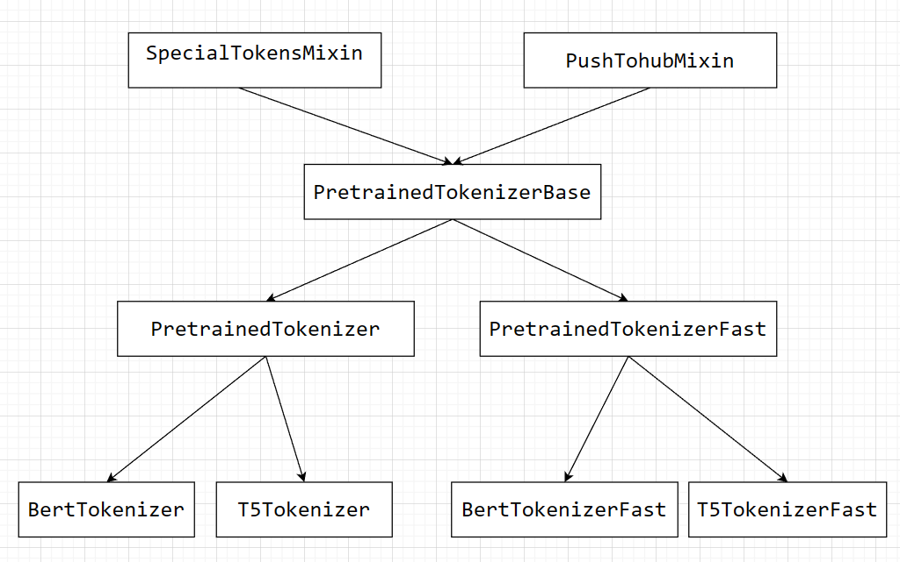

huggingface 的几个重要项目

- transformers
- datasets
- tokenizers
- accelerate
- huggingface-hub
- evaluate
- gradio: 一个适用于AI模型做demo的简易前端

# transformers 包

## 整体代码结构

构建模型主要的基类如下

- `PreTrainedModel`: 模型
- `PretrainedConfig`: 配置
- `PreTrainedTokenizerBase`: tokenizer

在以上三个类之上, `Pipeline` 基类用于组合这三个类.

另外, 还有些小东西: `ModelOutput`, 是模型输出的结果的基类.

`transformers` 的代码总体遵循的[设计哲学](https://huggingface.co/docs/transformers/v4.22.1/en/philosophy)是不强调代码复用, 比如没有一个 `attention.py` 文件中实现所有的注意力机制, 与之相对应的是将所有的模型基本上写在三个文件里, 例如在 `transformers/models/bart` 文件夹里与 `pytorch` 有关的代码文件如下:

```
modeling_bart.py
configuration_bart.py
tokenizer_bart.py
```

## 使用小技巧

### 实例化一个随机权重的模型

```
from transformers import T5Config, T5ForConditioalGeneration, T5Tokenizer

assert T5ForConditioalGeneration.config_class == T5Config

# 低级API
config = T5Config(json.load(open("config.json")))
config = T5Config.from_json_file("/path/to/model/config.json")
# 高级API(跟上面两种结果一致, 不会因为from_pretrained导致后面的model会load权重)
config = T5Config.from_pretrained("/path/to/model/")

# 权重随机初始化
model = T5ForConditioalGeneration(config)

# tokenizer的配置文件可能有若干个, 最好直接使用高阶API
# 例如: special_tokens_map.json, added_tokens.json, tokenizer_config.json 等
tokenizer = T5Tokenizer.from_pretrained("/path/to/model/")
```

### 关于 mask (待研究, 1和0是否有统一的语义约定)


## PreTrainedModel

### 使用

```python
pretrained_model_name_or_path = "fnlp/bart-base-chinese"
from transformers import BertTokenizer, BartForConditionalGeneration, Text2TextGenerationPipeline
tokenizer = BertTokenizer.from_pretrained(pretrained_model_name_or_path)
model = BartForConditionalGeneration.from_pretrained(pretrained_model_name_or_path)
text2text_generator = Text2TextGenerationPipeline(model, tokenizer)  
text2text_generator("北京是[MASK]的首都", max_length=50, do_sample=False)
# output:
# [{'generated_text': '北 京 是 中 国 的 首 都'}]
```

### 源码解析

transformers 代码中的带有 `from_pretrained` 的类都继承自 `PreTrainedModel`, 其具体继承关系如下:

```python
class ModuleUtilsMixin:
    pass
    # (@staticmethod) def _hook_rss_memory_pre_forward
    # (@staticmethod) def _hook_rss_memory_post_forward
    # def add_memory_hooks
    # def reset_memory_hooks_state
    # def invert_attention_mask
    # def get_extended_attention_mask
    # def get_head_mask
    # def _convert_head_mask_to_5d
    # def num_parameters
    # def estimate_tokens
    # def floating_point_ops
    # (@property) device
    # (@property) dtype

class GenerationMixin:
    pass
    # ===========
    # public methods:
    # ===========
    # @torch.no_grad()
    # def generate
    # def greedy_search
    # def sample
    # def beam_search
    # def beam_sample
    # def group_beam_search

class PushToHubMixin
    pass
    # ===========
    # public methods:
    # ===========
    # def push_to_hub

class PreTrainedModel(nn.Module, ModuleUtilsMixin, GenerationMixin, PushToHubMixin):
    # ...
    @classmethod
    def from_pretrained(
        cls,
        pretrained_model_name_or_path: Optional[Union[str, os.PathLike]],
        *model_args,
        **kwargs):

        ...
        model = cls(config, *model_args, **model_kwargs)
        ...
        return model
        
    # def save_pretrained
```

### example: BartForConditionalGeneration

具体到上面的例子中:

```python
# transformers/models/bart/modeling_bart.py
class BartPretrainedModel(PreTrainedModel):
    # some class attributes, ...
    def _init_weights(self, module):
        # pass ...
    def _set_gradient_checkpointing(self, module, value=False):
        # pass ...

class BartModel(BartPretrainedModel):
    # 具体的模型定义...
    def __init__(self, config: BartConfig):
        super().__init__(config)

        padding_idx, vocab_size = config.pad_token_id, config.vocab_size
        self.shared = nn.Embedding(vocab_size, config.d_model, padding_idx)

        self.encoder = BartEncoder(config, self.shared)  # 继承自BartPretrainedModel
        self.decoder = BartDecoder(config, self.shared)  # 继承自BartPretrainedModel

        # Initialize weights and apply final processing
        self.post_init()
    def forward(self, input_ids, attention_mask, ..., labels, ...):
        # pass ...
        # returns: Seq2SeqModelOutput

class BartForConditionalGeneration(BartPretrainedModel):
    def __init__(self, config: BartConfig):
        super().__init__(config)
        self.model = BartModel(config)
        self.register_buffer("final_logits_bias", torch.zeros((1, self.model.shared.num_embeddings)))
        self.lm_head = nn.Linear(config.d_model, self.model.shared.num_embeddings, bias=False)
        # Initialize weights and apply final processing
        self.post_init()
    def forward(self, input_ids, attention_mask, ..., labels, ...):
        # pass
        # returns: Seq2SeqModelOutput
```

### ModelOutput

```python
# src/transformers/modeling_outputs.py
class ModelOutput(OrderedDict):
    def __post_init__(self): ...
    def __delitem__(self, *args, **kwargs): ...
    def setdefault(self, *args, **kwargs): ...
    def pop(self, *args, **kwargs): ...
    def update(self, *args, **kwargs): ...
    def __getitem__(self, k): ...
    def __setattr__(self, name, value): ...
    def __setitem__(self, name, value): ...
    def to_tuple(self): ...

@dataclass
class BaseModelOutput(ModelOutput):
    last_hidden_state: torch.FloatTensor = None
    hidden_states: Optional[Tuple[torch.FloatTensor]] = None
    attentions: Optional[Tuple[torch.FloatTensor]] = None

# 备注: 注意此处源码中直接继承自ModelOutput而非BaseModelOutput
@dataclass
class Seq2SeqModelOutput(ModelOutput):
    # some attrs
```

## Pipeline

### 使用

```python
from transformers import pipeline
generator = pipeline(task="text-generation")
generator(
    "Three Rings for the Elven-kings under the sky, Seven for the Dwarf-lords in their halls of stone"
)  # doctest: +SKIP

# outputs: [{'generated_text': 'Three Rings for the Elven-kings under the sky, Seven for the Dwarf-lords in their halls of stone, Seven for the Iron-priests at the door to the east, and thirteen for the Lord Kings at the end of the mountain'}]
```


### 源码解析

```python
class _ScikitCompat(ABC):

    @abstractmethod
    def transform(self, X):
        raise NotImplementedError()

    @abstractmethod
    def predict(self, X):
        raise NotImplementedError()

class Pipeline(_ScikitCompat):
    def __init__(
        self,
        model: Union["PreTrainedModel", "TFPreTrainedModel"],
        tokenizer: Optional[PreTrainedTokenizer] = None,
        feature_extractor: Optional[PreTrainedFeatureExtractor] = None,
        modelcard: Optional[ModelCard] = None,
        framework: Optional[str] = None,
        task: str = "",
        args_parser: ArgumentHandler = None,
        device: int = -1,
        binary_output: bool = False,
        **kwargs,
    ):

# src/transformers/pipelines/__init__.py
def pipeline(...):
    ...
    pipeline_class(model=model, framework=framework, task=task, **kwargs)
```

`framework` 取值为 `tf` 或者 `pt`, 代表 `tensorflow` 和 `pytorch`. 一般用于指示代码的输出为 `tf.tensor` 或 `torch.tensor`.


## PreTrainedTokenizerBase

继承关系如下图所示:



其中 `Fast` 版本的 `Tokenizer` 依赖于 huggingface tokenizers 库中的实现, 而普通版本的 `Tokenizer` 是 huggingface transformers 库中纯 Python 的实现。

在查阅网上不同的资料的过程中，会有几个疑问：

- 查询 tokenizer 词表的基本信息例如词表、特殊 token 的方法有哪些？
- 往往会发现许多关于 `Tokenizer` 相似的方法调用，例如下面这些，但它们之间的关联/区别是什么？
    ```python
    tokenizer(...)
    tokenizer.tokenize(...)
    tokenizer.encode(...)
    tokenizer.encode_plus(...)
    tokenizer.batch_encode_plus(...)
    tokenizer.pad()
    tokenizer.decode()
    tokenizer.batch_decode()
    ```
- 添加 token 的方法有哪些，区别是什么？
    ```python
    tokenizer.add_tokens(...)
    tokenizer.add_special_tokens(...)
    ```
- 怎么训练得到一个 tokenizer

以 `BertTokenizer` 为例，向上追溯至 `SpecialTokensMixin`，`PretrainedTokenizerBase`、`PretrainedTokenizer` 中的一些方法，来回答上述的这些问题：

针对前面几个问题，相关的方法在继承关系中实质上的定义位置如下图所示：


**获取 tokenizer 的基本信息**

```python
from transformers import BertTokenizer

tokenizer = BertTokenizer.from_pretrained("chinese-roberta-wwm-ext")
# 以下方法均注明了在继承关系中最上层的非抽象方法

# 获取vocab_to_index字典(包含特殊token及通过add_tokens添加的token)
# PretrainedTokenizer/PretrainedTokenizerFast
str2idx = tokenizer.get_vocab()  # {"[UNK]": 100, "[SEP]": 102}

# 获取index_to_vocab字典: 没有直接方法

# 获取总的token数(包含特殊token及通过add_tokens添加的token)
# PretrainedTokenizerBase: self.vocab_size + len(self.added_tokens_encoder)
len(tokenizer)
# model.resize_token_embeddings(len(tokenizer))

# vocab_size(包含特殊token但不包含add_tokens添加的token)
# BertTokenizer/BertTokenizerFast
tokenizer.vocab_size

# self.added_tokens_encoder/self.added_tokens_encoder: 长度相同的字典, 分别代表add_token2int和int2add_token
# PretrainedTokenizer/PretrainedTokenizerFast

# [待续...]
# convert_tokens_to_ids: 
# PretrainedTokenizer/PretrainedTokenizerFast, 但最终需要调用BertTokenizer._convert_token_to_id


# convert_ids_to_tokens
# PretrainedTokenizer/PretrainedTokenizerFast, 但最终需要调用BertTokenizer._convert_id_to_token
```

**几个相似的方法**

```python
tokenizer.tokenize("I'm a student")  # 将字符串转换为token列表
# ['i', "'", 'm', 'a', 'st', '##ude', '##nt']
tokenizer.convert_tokens_to_ids(tokenizer.tokenize("I'm a student"))  # 查token2id表, 将token序列转换为id列表
# [151, 112, 155, 143, 8811, 11997, 8511]
tokenizer.encode("I'm a student")  # 结合tokenize与convert_tokens_to_ids两步, 并进行后处理(增加BOS和EOS)
# [101, 151, 112, 155, 143, 8811, 11997, 8511, 102]
tokenizer("I'm a student")  # 转换为模型的输入
# {'input_ids': [101, 151, 112, 155, 143, 8811, 11997, 8511, 102],
#     'token_type_ids': [0, 0, 0, 0, 0, 0, 0, 0, 0],
#     'attention_mask': [1, 1, 1, 1, 1, 1, 1, 1, 1]}
```

备注：
- `__call__` 方法实质上根据输入是文本列表或文本，分别调用了 `batch_encode_plus` 或 `encode_plus` 方法
- `encode_plus` 方法实质上是依次调用了 `tokenize`、`convert_tokens_to_ids` 和 `prepare_for_model` 等方法
- `batch_encode_plus` 方法实质上是依次调用了 `tokenize`、`convert_tokens_to_ids`、`prepare_for_model`、`pad` 等方法
- `encode` 方法实质上是调用了 `encode_plus` 方法，然后只取出 `"input_ids"` 作为返回值
- `decode` 方法实质上是依次调用 `convert_ids_to_tokens`、`convert_tokens_to_string` 等方法将整数序列转换为文本
- `batch_decode` 方法实质上是对输入使用 `decode` 方法进行列表推导式


**添加token的方法及注意事项**

添加 token 的方法来源于 `SpecialTokensMixin` 中的 `add_tokens` 与 `add_special_tokens`，而 `add_special_tokens` 方法最终会使用到 `add_tokens` 方法。在使用上，在增加了 token 后，模型侧需要将 embedding 进行 resize，最常见的做法如下：

```python
from transformers import BertTokenizerFast, BertModel
tokenizer = BertTokenizerFast.from_pretrained("bert-base-uncased")
model = BertModel.from_pretrained("bert-base-uncased")

num_added_toks = tokenizer.add_tokens(["new_tok1", "[my_new-tok2]"], special_tokens=True)
print("We have added", num_added_toks, "tokens")
# Notice: resize_token_embeddings expect to receive the full size of the new vocabulary, i.e., the length of the tokenizer.
model.resize_token_embeddings(len(tokenizer))
```

备注：针对 `BertTokenizer` 而言，可以使用如下技巧避免对 model 进行改动
```python
# [unused1] 与 [unused2] 都在词表里, 是预留的自定义符号
num_added_toks = tokenizer.add_tokens(["[unused1]", "[unused2]"], special_tokens=True)  # num_added_toks为0
```

**怎么训练得到一个 tokenizer**

参考资料（待续）：
- huggingface tokenizer 官方文档：https://huggingface.co/docs/tokenizers/index

## Trainer

一个完整的例子可以参考 transformers GitHub 源码 `examples/pytorch/summarization/run_summarization.py`

使用方式如下:
```python
trainer = Seq2SeqTrainer(
    model=model,
    args=training_args,
    train_dataset=train_dataset if training_args.do_train else None,
    eval_dataset=eval_dataset if training_args.do_eval else None,
    tokenizer=tokenizer,
    data_collator=data_collator,
    compute_metrics=compute_metrics if training_args.predict_with_generate else None,
)
trainer.train(resume_from_checkpoint=checkpoint)
```

其中`training_args`以如下方式获取到：
- `Seq2SeqTrainingArguments` 继承自 `transformers.TrainingArguments`(被dataclass装饰)，只是一个自定义的“结构体”
- 而 `HfArgumentParser` 继承自 `argparse.ArgumentParser`，`HfArgumentParser`只是在父类的基础上增加了几个方法：`parse_json_file`、`parse_args_into_dataclasses` 等
- `transformers.Seq2SeqTrainer`继承自`transformers.Trainer`，`Seq2SeqTrainer`只是在父类的基础上覆盖了少量的几个方法：它的主体逻辑例如配置多卡训练，整体循环迭代等过程继承自`transformers.Trainer`，仅覆盖一些`training_step`中的关键步骤。

```python
parser = HfArgumentParser((ModelArguments, DataTrainingArguments, Seq2SeqTrainingArguments))
if len(sys.argv) == 2 and sys.argv[1].endswith(".json"):
    model_args, data_args, training_args = parser.parse_json_file(json_file=os.path.abspath(sys.argv[1]))
else:
    model_args, data_args, training_args = parser.parse_args_into_dataclasses()
```

而`Trainer.train`的循环体为`Trainer.training_step`

```python
# evaluate用于计算指标?predict只用作预测

# 实际执行trainer.evaluate_loop/prediction_loop
trainer.evaluate()
# 实际执行trainer.evaluate_loop/prediction_loop
trainer.predict()

# trainer.evaluate_loop/prediction_loop最终都是循环执行trainer.prediction_step
# 备注: 没有evaluate_step
```

`Seq2SeqTrainer`继承自`Trainer`, 只重载了`evaluate`,`predict`,`prediction_step` 这几个方法

关于 `transformers.Trainer`：
- `Trainer.__init__`函数中也允许传入一些`callback`, 与`pytorch-lightning`类似, 但`hook`会更少一些

**关于 HfArgumentParser 的一个小示例**

```python
from transformers import HfArgumentParser, TrainingArguments
from dataclasses import dataclass, field
from typing import Optional
from argparse import ArgumentParser
import sys
import yaml

@dataclass
class DataTrainingArguments:
    lang: str = field(default=None, metadata={"help": "xxx"})
    dataset_name: Optional[str] = field(default=None, metadata={"help": "yyy"})

@dataclass
class ModelArguments:
    path: str = field(metadata={"help": "zzz"})

# 目的是可以用 --yaml a.yaml --path a.txt --lang en 进行传参,
# 且--yaml参数解析的字段会被其他的字段例如: path, lang 覆盖.

# 直接使用 parse_args_into_dataclasses 或 parse_yaml_file 无法处理这种特殊情况
# --yaml a.yaml --path a.txt (假定 a.yaml 中没有指定 path)
parser = ArgumentParser()
parser.add_argument("-y", "--yaml", type=str, required=False)
args, others = parser.parse_known_args(sys.argv[1:])
if args.yaml:
    with open(args.yaml) as fr:
        d = yaml.safe_load(fr)
else:
    d = {}
others = [x for k, v in d.items() for x in ["--"+k, str(v)]] + others
parser = HfArgumentParser((DataTrainingArguments, ModelArguments, TrainingArguments))
data_args, model_args, train_args = parser.parse_args_into_dataclasses(others)
print(data_args, model_args, train_args)
```


Trainer的扩展方式有两种:
- 增加Callback,但作用有限,按官方的说法callback不影响训练流程
- 集成Trainer类,重写一些方式例如:`compute_loss`

### `TrainerControl`, `TrainerState`, `CallbackHandler`, `TrainerCallback`

`Trainer` 中包含：
- `TrainerControl`: 一些是否需要保存,是否需要记录日志的标志
- `TrainerState`: 记录当前的训练轮数等,注意log_history是历史的日志记录列表
- `CallbackHandler`: for循环各个callback进行调用

```python
@dataclass
class TrainerControl:
    should_training_stop: bool = False
    should_epoch_stop: bool = False
    should_save: bool = False
    should_evaluate: bool = False
    should_log: bool = False
    # 一些小方法用于设定上面这些参数

@dataclass
class TrainerState:
    epoch: Optional[float] = None
    global_step: int = 0
    max_steps: int = 0
    num_train_epochs: int = 0
    log_history: List[Dict[str, float]] = None
    # 一些小方法及其他参数略

class CallbackHandler:
    # __init__函数包含 callbacks,model,tokenizer,optimizer,lr_scheduler等
    # 主要函数为
    # 例子, 还有许多 on_xxx 的 hook 方法
    def on_log(self, args: TrainingArguments, state: TrainerState, control: TrainerControl, logs):
        control.should_log = False
        return self.call_event("on_log", args, state, control, logs=logs)
    def call_event(self, event, args, state, control, **kwargs):
        for callback in self.callbacks:
            result = getattr(callback, event)(
                args,
                state,
                control,
                model=self.model,
                tokenizer=self.tokenizer,
                optimizer=self.optimizer,
                lr_scheduler=self.lr_scheduler,
                train_dataloader=self.train_dataloader,
                eval_dataloader=self.eval_dataloader,
                **kwargs,
            )
            # A Callback can skip the return of `control` if it doesn't change it.
            if result is not None:
                control = result
        return control  
```

总的来说, huggingface transformers 库的 Trainer 写得不是太好, 不利于扩展，但怎么结合 `pytorch-lightning` 使用 huggingface transformers 库的模型: [lightning-transformers](https://lightning-transformers.readthedocs.io/en/latest/)

### 如何增加 Tensorboard 的打印信息

首先看一下 `TensorBoardCallback` 的实现
```python
class TensorBoardCallback(TrainerCallback):
    def on_train_begin(...): ...
    def on_train_end(...): ...
    # 只摘录代码核心部分
    def on_log(self, args, state, control, logs=None, **kwargs):
        # rewrite_logs 会对 key 进行转换:
        # "train_loss" -> "train/train_loss"
        # "others" -> "train/others"
        # "eval_xxx" -> "eval/xxx"
        # "test_yyy" -> "test/yyy"
        logs = rewrite_logs(logs)
        for k, v in logs.items():
            self.tb_writer.add_scalar(k, v, state.global_step)
```

接下来看Trainer中跟 `TensorBoardCallback` 相关的代码
```python
class Trainer:
    def __init__(self, ..., report_to, ...):
        # 默认会将TensorBoardCallback加入callback中
    
    # 此函数仅在三处被调用, 见如下
    def log(self, logs: Dict[str, float]) -> None:
        # 官方建议重载此方法
        if self.state.epoch is not None:
            logs["epoch"] = round(self.state.epoch, 2)

        output = {**logs, **{"step": self.state.global_step}}
        self.state.log_history.append(output)
        self.control = self.callback_handler.on_log(self.args, self.state, self.control, logs)

    # 此函数仅在self.train函数中被调用
    def _maybe_log_save_evaluate(self, tr_loss, model, trial, epoch, ignore_keys_for_eval):
        if self.control.should_log:
            logs["loss"] = round(tr_loss_scalar / (self.state.global_step - self._globalstep_last_logged), 4)
            logs["learning_rate"] = self._get_learning_rate()
            # self.log被调用的【第一处】
            self.log(logs)

        if self.control.should_evaluate:
            metrics = self.evaluate(ignore_keys=ignore_keys_for_eval)
    
    # 此函数仅在self._maybe_log_save_evaluate函数中被调用
    def evaluate(
        self,
        eval_dataset: Optional[Dataset] = None,
        ignore_keys: Optional[List[str]] = None,
        metric_key_prefix: str = "eval",
    ) -> Dict[str, float]:
        eval_dataloader = self.get_eval_dataloader(eval_dataset)
        eval_loop = self.prediction_loop if self.args.use_legacy_prediction_loop else self.evaluation_loop
        output = eval_loop(
            eval_dataloader,
            description="Evaluation",
            # No point gathering the predictions if there are no metrics, otherwise we defer to
            # self.args.prediction_loss_only
            prediction_loss_only=True if self.compute_metrics is None else None,
            ignore_keys=ignore_keys,
            metric_key_prefix=metric_key_prefix,
        )
        output.metrics.update(
            speed_metrics(
                metric_key_prefix,
                start_time,
                num_samples=output.num_samples,
                num_steps=math.ceil(output.num_samples / total_batch_size),
            )
        )
        # self.log被调用的【第二处】
        self.log(output.metrics)
        return output.metrics
    
    # 只摘录跟log有关的部分
    def train():
        for epoch in range(epochs_trained, num_train_epochs):
            for step, inputs in enumerate(epoch_iterator):
                # 计算loss
                if (step + 1) % args.gradient_accumulation_steps == 0 or (
                    steps_in_epoch <= args.gradient_accumulation_steps
                    and (step + 1) == steps_in_epoch
                ):
                    self.optimizer.step()
                    self.lr_scheduler.step()
                    model.zero_grad()
                    self.control = self.callback_handler.on_step_end(args, self.state, self.control)
                    # 注意: 此处有可能会产生log
                    self._maybe_log_save_evaluate(tr_loss, model, trial, epoch, ignore_keys_for_eval)
                else:
                    self.control = self.callback_handler.on_substep_end(args, self.state, self.control)
            self.control = self.callback_handler.on_epoch_end(args, self.state, self.control)
            # 注意: 此处有可能会产生log
            self._maybe_log_save_evaluate(tr_loss, model, trial, epoch, ignore_keys_for_eval)
        metrics = speed_metrics("train", start_time, num_samples=num_train_samples, num_steps=self.state.max_steps)
        self.store_flos()
        metrics["total_flos"] = self.state.total_flos
        metrics["train_loss"] = train_loss
        # mertics 最终包含这几个key, 并且这几个key训练完毕后散点图上只有这一个散点
        # "train_runtime", "train_samples_per_second", "train_steps_per_second"
        # "total_flos", "train_loss"
        # self.log被调用的【第三处】
        self.log(metrics)
```

因此，自定义tensorboard的输出内容（在不自定义子类重写`self.train`方法的前提下）：
- 每隔100个batch，输出训练集的损失：无法做到，原因是 `_maybe_log_save_evaluate` 无法传递当前batch的数据信息，因此训练集的信息很难记录在日志中
- 每个100个batch，输出验证集的损失：可以增加一个Callback，在隔100个batch时，将`self.control.should_evaluate`设置为`True`
- 输出验证集的其他信息，例如计算准确率，召回率等多个指标时：自定义一个 `CustomTrainer` 继承自 `Trainer`，重载 `self.evaluate` 方法，并在这个重载方法内部使用 `self.log` 方法记录到日志中

终极解决方案：自定义子类重写`Trainer.train`方法，在必要的地方增加逻辑进行日志记录。但`self.train`方法的代码过于冗长（大约400行代码），基本上这种做法需要将原本的 `train` 方法抄录大部分。因此，使用 `Trainer` 不太能随心所欲地增加日志打印逻辑。

### 模型保存相关

训练时的保存总入口在 `trainer._save_checkpoint` 函数处，主要保存以下内容：

```
checkpoint-{global_step}/
  
  # 跟 trainer 相关的
  - optimizer.pt
  - scheduler.pt
  - scaler.pt
  - training_args.bin
  - trainer_state.json
  - rng_state.pth(rng_state_{local_rank}.pth)
  
  # 跟 PreTrainedModel 相关的
  - pytorch_model.bin(self.model.save_pretrained)
  - config.json(self.model.save_pretrained)
  
  # 跟 PreTrainedTokenizerBase 相关的
  - tokenizer_config.json(tokenizer.save_pretrained)
  - tokenizer.json(tokenizer.save_pretrained)
  - vocab.txt(tokenizer.save_pretrained)
  - ...
```

### 离线使用数据集、metric、模型文件

运行示例：[官方示例](https://pytorch-lightning.readthedocs.io/en/stable/notebooks/lightning_examples/text-transformers.html)

此脚本使用 `transformers` 包加载模型，使用 `datasets` 加载数据集以及 metric。

- 模型的离线下载：去 [huggingface](https://huggingface.co/) 搜索并下载, 并在 `from_pretrained` 函数参数替换为本地路径
- 数据离线下载：去 [huggingface](https://huggingface.co/) 搜索并下载, 并在 `load_dataset` 函数参数替换为本地路径。
  - 备注：在上面这个例子中，下载的是 `glue` 数据集下的 `mrpc` 数据，因此搜索下载好 `glue` 数据集后，还需要进一步根据 `data_infos.json` 与 `glue.py` 内的内容下载 `mrpc` 数据文件
  ```text
  glue/  # 可以在 https://huggingface.co/ 搜索并下载
    - README.md
    - dataset_infos.json
    - glue.py
  mrpc/  # 根据 dataset_infos.json 文件内容手动下载
    - mrpc_dev_ids.tsv
    - msr_paraphrase_test.txt
    - msr_paraphrase_train.txt
  ```
  注意如果按上述方式组织文件，需要做几项修改：
  ```text
  # data_infos.json
  https://dl.fbaipublicfiles.com/glue/data/mrpc_dev_ids.tsv -> ../mrpc/mrpc_dev_ids.tsv
  https://dl.fbaipublicfiles.com/senteval/senteval_data/msr_paraphrase_train.txt -> ../mrpc/msr_paraphrase_train.txt
  https://dl.fbaipublicfiles.com/senteval/senteval_data/msr_paraphrase_test.txt -> ../mrpc/msr_paraphrase_test.txt
  # glue.py 将以下三行修改为
  # _MRPC_DEV_IDS = "https://dl.fbaipublicfiles.com/glue/data/mrpc_dev_ids.tsv"
  # _MRPC_TRAIN = "https://dl.fbaipublicfiles.com/senteval/senteval_data/msr_paraphrase_train.txt"
  # _MRPC_TEST = "https://dl.fbaipublicfiles.com/senteval/senteval_data/msr_paraphrase_test.txt"
  _MRPC_DEV_IDS = "../mrpc/mrpc_dev_ids.tsv"
  _MRPC_TRAIN = "../mrpc/msr_paraphrase_train.txt"
  _MRPC_TEST = "../mrpc/msr_paraphrase_test.txt"
  ```
- metric离线下载: 在有网环境下使用 `load_metric` 函数，默认缓存目录为 `~/.cache/huggingface/modules/datasets_modules/metrics/glue/91f3cfc5498873918ecf119dbf806fb10815786c84f41b85a5d3c47c1519b343`。只需要将此目录下的文件拷贝出来，在无网环境下将 `load_metric` 函数参数替换为本地路径。

# datasets


## datasets.load_dataset

`datasets.load_dataset`用于加载数据集, 适用于如下情况：
- huggingface hub 维护的数据集, 执行逻辑为下载数据集(有可能会去找到该仓库的同名下载与数据预处理脚本),然后缓存至 `~/.cache/huggingface/datasets` 目录（默认缓存为`.arrow`格式）, 最后返回数据集
- 本地数据集情形下，依然会缓存至 `~/.cache/huggingface/datasets` 目录，然后返回数据集
- 如果本地已缓存则直接读缓存，详情[参考](https://huggingface.co/docs/datasets/v2.9.0/en/cache#cache-management)

```python
# 本地csv文件
from datasets import load_dataset
dataset = load_dataset('csv', data_files={'train': 'a.csv', 'test': 'b.csv'})
```

输出结果
```
Using custom data configuration default-da3e05bd9f37d26d
Downloading and preparing dataset csv/default to /home/buxian/.cache/huggingface/datasets/csv/default-da3e05bd9f37d26d/0.0.0/6b34fb8fcf56f7c8ba51dc895bfa2bfbe43546f190a60fcf74bb5e8afdcc2317...
Downloading data files: 100%|███████████████████████████████████████████████████████████████████████████████| 2/2 [00:00<00:00, 263.91it/s]
Extracting data files: 100%|█████████████████████████████████████████████████████████████████████████████████| 2/2 [00:00<00:00, 29.91it/s]
Dataset csv downloaded and prepared to /home/buxian/.cache/huggingface/datasets/csv/default-da3e05bd9f37d26d/0.0.0/6b34fb8fcf56f7c8ba51dc895bfa2bfbe43546f190a60fcf74bb5e8afdcc2317. Subsequent calls will reuse this data.
```

备注：

- 输出结果里：Downloading and preparing dataset及以下的内容的逻辑发生在`datasets.builder:DatasetBuilder.download_and_prepare`函数内


load_dataset 函数的全部参数如下(没有按照实际的参数列表排列):

个人觉得常用的

- path, name, split: [参考官方文档](https://huggingface.co/docs/datasets/v2.12.0/en/load_hub), path 一般是huggingface hub的仓库名, name 在官方文档中被称为 dataset configuration, 一般是指一个数据集的几个子数据集, split 一般取值为 "train", "test" 等
- data_dir, data_files: 这两个参数一般适用 path="csv","json" 等
- cache_dir, keep_in_memory, storage_options: cache_dir 对应于默认的缓存目录 `HF_DATASETS_CACH=~/.cache/huggingface/datasets`, keep_in_memory 表示不使用缓存, storage_options 目前还不清楚使用场景
- streaming: 流式下载
- num_proc: 多进程处理

不常用的

- features: 不清楚
- download_config, download_mode, verification_mode, ignore_verification: 与下载相关的, 不清楚
- save_infos: 不清楚
- revision, use_auth_token: 与下载版本及下载权限相关
- task: 不清楚
- **config_kwargs: 不清楚


**缓存数据文件手动读取**
```python
import pyarrow as pa

# 找到缓存的.arrow文件位置
filename = "/home/buxian/.cache/huggingface/datasets/custom_squad/plain_text/1.0.0c6c7330bf7fd4d7dc964ac79c0c71bfac098436da8f0c7c19e62999b3e8cb8f3/custom_squad-train.arrow"

memory_mapped_stream = pa.memory_map(filename)
opened_stream = pa.ipc.open_stream(memory_mapped_stream)
# pyarrow.Table
pa_table = opened_stream.read_all()
```

## 缓存目录

huggingface所有项目的默认缓存目录为`~/.cache/huggingface`

```
datasets/  # 用于缓存跟huggingface datasets模块的东西
  - csv/
  - custom_squad/
  - ...
hub/  # 缓存一些跟huggingface hub相关的东西?
  - models--ConvLab--t5-small-nlg-multiwoz21/
metrics/  # 缓存一些指标计算所必要的文件
  - glue/
    - mrpc/
modules/
  - __init__.py
  - datasets_modules
    - datasets  # load_dataset时所需的脚本
      - __init__.py
      - custom_squad/  # 不同版本的预处理文件(hash值由脚本文件内容计算得出)
        - 397916d1ae99584877e0fb4f5b8b6f01e66fcbbeff4d178afb30c933a8d0d93a/
          - README.md
          - __init__.py
          - custom_squad.json
          - custom_squad.py
        - 9daa4a09a366f6e69f7b3ba326b95b5f773487c094c7df0c1b9715aaf1b8b19b/
          - README.md
          - __init__.py
          - custom_squad.json
          - custom_squad.py
    - metrics/
      - glue/  # 此处的脚本也是下载缓存下来的(datasets.load_metric('glue', 'mrpc'))
        - 91f3cfc5498873918ecf119dbf806fb10815786c84f41b85a5d3c47c1519b343/
          - __init__.py
          - glue.json
          - glue.py
```

仅就 `datasets` 模块而言, 缓存的实际内容为【某个数据集使用特定的预处理脚本处理后最终得到的数据文件】，而这些【数据文件】默认以 `.arrow` 的方式进行缓存。

根据需求不同，对 `datasets.load_dataset` 的参数有不同的设定

|原始文件位置|预处理方法|做法|传参|
|-----------|---------|----|----|
|本地|json/csv格式默认的读取方式|无|`path='csv', data_files='a.csv'`|
|本地|自定义|编写预处理脚本得到datasets.arrow_dataset.Dataset|`path='/path/to/script.py'`|
|Huggingface Hub的datasets中|Hub仓库中的下载以及预处理方式|无|`path='username/dataname'`|
|Huggingface Hub的datasets中|自定义预处理方式|编写预处理脚本得到datasets.arrow_dataset.Dataset：方式一、参考Hub仓库中的默认预处理方式,自己编写预处理脚本，这种方法编写的脚本里应包含下载数据的过程；方式二、如有网络问题也可以预先将原始数据下载下来后再针对本地文件编写预处理脚本|`path='/path/to/script.py'`|

## `Dataset` 变换

具体使用参考[官方文档](https://huggingface.co/docs/datasets/process)

- `map`: 对每条数据进行变换
- `filter`、`select`: 挑选数据

```python
from datasets import load_dataset
dataset = load_dataset("glue", "mrpc")
dataset.select(range(128))  # 将数据集缩小
```

## 一些不理解的代码

```python
from datasets import Dataset
import datasets

def data_gen():
    for i in range(10):
        yield {"idx": i, "text": f"text_{i}"}

dataset = Dataset.from_generator(data_gen)
dataset.save_to_disk("hf-data-temp")
# 保存了如下文件: hf-data-temp/{data-00000-of-00001.arrow,dataset_info.json,state.json}
dataset = datasets.load_from_disk("hf-data-temp")  # 似乎不能使用load_dataset
dataset = dataset.map(lambda x: {"a": "a" + x["text"]}, batched=False)  # 生成hf-data-temp/cache-xxx.arrow
dataset = dataset.map(lambda x: {"b": "b" + x["text"]}, batched=False)  # 生成hf-data-temp/cache-yyy.arrow
import os
os.makedirs("ssss", exist_ok=True)
# 指定cache_file_name有可能会直接读取缓存, 跟原始流程对不上
dataset = dataset.map(lambda x: {"b": "b" + x["text"]}, batched=False, cache_file_name="ssss/hug")  # 生成ssss/hug

# datasets.load_from_disk("ssss/hug")  # 报错！！！
```
第二次执行时会从缓存中读取


# tokenizers 包

`tokenizers` 包在安装 `transformers` 包时会自动进行安装，在 `transformers` 包中如何被使用需要进一步研究。

# huggingface-hub 包

`huggingface-hub` 包在安装 `transformers`、`datasets` 包时会自动进行安装。前面在 `transformers` 包与 `datasets` 包中已简单涉及了许多关于 huggingface 缓存目录的介绍，此处更加清晰地进行介绍：

```
~/.cache/huggingface/
  - datasets/
  - hub/  # `huggingface-hub` 模块
    - models--julien-c--EsperBERTo-small/
    - models--lysandrejik--arxiv-nlp/
    - models--bert-base-cased/
    - datasets--glue/
    - datasets--huggingface--DataMeasurementsFiles/
    - spaces--dalle-mini--dalle-mini/
  - modules/
    - datasets_modules/
    - evaluate_modules/
```

首先理清一下 huggingface 各个模块关于缓存目录的设置：

- `huggingface-hub` 包的默认缓存目录为 `HUGGINGFACE_HUB_CACHE=~/.cache/huggingface/hub`，其本质是对 `git` 的一层封装。
- `transformers` 包的默认缓存目录为 `TRANSFORMERS_CACHE=~/.cache/huggingface/hub`（与`huggingface-hub`**一致**，并且本质上是直接复用了`huggingface-hub`的缓存方式，即 `blobs`、`refs`、`snapshots` 的方式）
- `datasets` 包的默认缓存目录为：`HF_DATASETS_CACHE=~/.cache/huggingface/datasets`（与`huggingface-hub`**不一致**，其本质上是建立了自己的一套缓存数据集的方式，即采用 `arrow` 格式对数据进行缓存，从而加速数据的加载速度，提升训练效率），另外，使用 `datasets.load_dataset` 时会将需要的脚本缓存至 `~/.cache/huggingface/modules/datasets_modules` 目录
- `evaluate` 包设定了如下一些默认缓存路径：
  - `HF_METRICS_CACHE=~/.cache/huggingface/metrics`
  - `HF_EVALUATE_CACHE=~/.cache/huggingface/evaluate`
  - `HF_MODULES_CACHE=~/.cache/huggingface/modules/evaluate_modules`
- `diffusers` 包的默认缓存目录为：`DIFFUSERS_CACHE=~/.cache/huggingface/diffusers`，而需要的脚本缓存目录设定在 `~/.cache/huggingface/modules/diffusers_modules` 目录

从上面可以看出，`huggingface-hub` 包作为 huggingface 所有项目的“基础建设”，各个下游项目会根据需要决定是否完全复用这一“基础建设”。以下是一些具体的例子：

```python
from transformers import AutoTokenizer, AutoModelForSeq2SeqLM
tokenizer = AutoTokenizer.from_pretrained("ConvLab/mt5-small-nlg-multiwoz21")
model = AutoModelForSeq2SeqLM.from_pretrained("ConvLab/mt5-small-nlg-multiwoz21")
# 下载到 hub/models--Convlab--t5-small-nlg-multiwoz21/ 目录, 由子目录 blobs, refs, snapshots 目录构成

import datasets
datasets.load_dataset("rotten_tomatoes")
# 下载到 datasets/rotten_tomatoes/ 目录, 内部目录为 default/1.0.0/<hash值>/{*.arrow,...}
# 同时将脚本下载到 modules/datasets_modules/datasets/rotten_tomatoes/<hash值>/{rotten_tomatoes.py,...}

from huggingface_hub import snapshot_download
snapshot_download(repo_id="rotten_tomatoes", repo_type="dataset")
# 下载到 hub/datasets--rotten_tomatoes 目录, 由子目录 blobs, refs, snapshots 目录构成

# 以下两者完全一致:
# hub/datasets--rotten_tomatoes/snapshots/c33cbf965006dba64f134f7bef69c53d5d0d285d/rotten_tomatoes.py
# modules/datasets_modules/datasets/rotten_tomatoes/40d411e45a6ce3484deed7cc15b82a53dad9a72aafd9f86f8f227134bec5ca46/rotten_tomatoes.py

import evaluate  # 仓库位于huggingface-hub的spaces中
evaluate.load("lvwerra/element_count", module_type="measurement")
# 下载到 modules/evaluate_modules/metrics/lvwerra--element_count/<hash值>/{element_count.py,...}
```

基本上都可以通过 `huggingface-hub` 的接口将 `datasets`、`models`、`spaces` 下载到本地，然后各个下游的包例如：`transformers`、`evaluate`、`datasets`、`diffusers` 中加载模型/数据集/脚本的函数中传入本地路径即可。

关于 huggingface-hub 缓存目录的[官方文档](https://huggingface.co/docs/huggingface_hub/how-to-cache)

从 hub 下载文件的主要接口是 `hf_hub_download` 与 `snapshot_download`，参考[官方文档](https://huggingface.co/docs/huggingface_hub/how-to-downstream)即可


## 怎样确认文件下载正确

以下载 `bert-base-uncased/pytorch_model.bin` 文件为例

```python
from huggingface_hub import model_info
model_info("bert-base-uncased", revision="main", files_metadata=True)

# 输出结果里包含如下输出
# RepoFile: { 
#     {'blob_id': 'ba5d19791be1dd7992e33bd61f20207b0f7f50a5',
#      'lfs': {'pointerSize': 134,
#              'sha256': '097417381d6c7230bd9e3557456d726de6e83245ec8b24f529f60198a67b203a',
#              'size': 440473133},
#      'rfilename': 'pytorch_model.bin',
#      'size': 440473133}
```

检验本地下载的数据是否与上面的信息一致
```shell
sha256sum pytorch_model.bin  # 097417381d6c7230bd9e3557456d726de6e83245ec8b24f529f60198a67b203a
```


# accelerate 包

`accelerate` 在安装 `transformers` 包时不会进行安装

# safetensors

pytorch 的 `torch.save` 与 `torch.load` 底层使用了 pickle, 被认为是不安全的格式 (假设你打开这个文件, 那么它就有可能执行任意代码: Arbitrary Code Execution, ACE: people can do whatever they want with your machine), 具体解释可以参考: [https://github.com/huggingface/safetensors/discussions/111](https://github.com/huggingface/safetensors/discussions/111)

具体的API参见官方文档即可, 这里仅对存储格式做探究

```python
import numpy as np
import json
# torch.frombuffer 是 torch 1.10.0 的新API, 因此这里用 np.frombuffer
path = "./huggingface/distilbert-base-uncased/model.safetensors"
with open(path, "rb") as fr:
    x = fr.read(8)
    num = np.frombuffer(x, dtype=int64)[0]  # header 的长度
    header = json.loads(fr.read(num).decode())
    print(header)  # 显示"distilbert.embeddings.LayerNorm.bias" 的offset是[0, 3072]
    data = fr.read(3072)
    tensor = np.frombuffer(3072, dtype=np.float32)
    y = tensor[:3]

from safetensors import safe_open
with open(path, framework="np") as fr
    z = get_tensor("distilbert.embeddings.LayerNorm.bias")[:3]

np.all(y == z)  # True
```


# 结合 pytorch-lightning 使用 transformers 训练

[源码](./lightning-src/pl_transformers.py)

# 依赖的一些其他三方库学习

- [filelock](https://pypi.org/project/filelock/): 文件锁?安全读写文件时有用?
- [pyarrow](https://arrow.apache.org/docs/python/): `datasets` 底层依赖的存储方式
