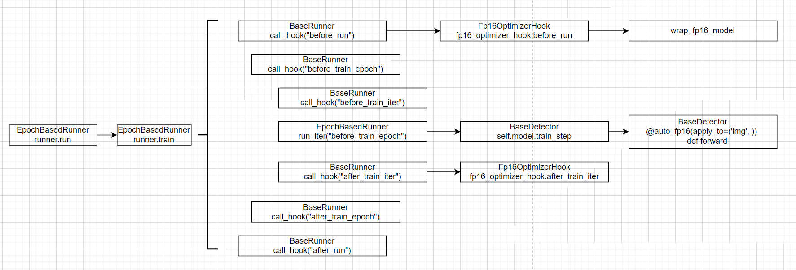

# MMCV/MMDETECT 架构分析

mmcv 是 mmdet 的主要依赖包。mmcv 的特点是广泛地使用配置文件来规范化模型的构建、训练等。实现这一特性的核心是 mmcv 的 `Config` 类与 `Registry` 类。分别定义于 `mmcv/utils/config.py` 与 `mmcv/utils/registry.py` 文件中。以下架构分析**针对的版本为**：

- mmcv-full 1.3.9
- mmdetection （git commit id: 522eb9ebd7df0944b2a659354f01799895df74ce，版本为2.14~2.15之间）

与许多优秀的开源项目一样，mmlab 的项目也会存在 API 变化的现象，大多数时候 mmlab 会对之前的 API 兼容，但给出警告。对于源码分析而言，这种代码是一种干扰。

## 安装

源码安装 mmcv-full，可能需要修改 `setup.py`

```python
# cmd_class = {'build_ext': torch.utils.cpp_extension.BuildExtension}
cmd_class = {'build_ext': torch.utils.cpp_extension.BuildExtension.with_options(use_ninja=False)}
```

随后使用如下命令进行安装

```bash
MMCV_WITH_OPS=1 pip install -e .  # 开发模式安装
MMCV_WITH_OPS=1 python setup.py install  # 安装
```

## 典型用法（此处补充一个 mmdet 的例子）：

```python
dataset = DATASET.build(Config.fromfile("xxx.py"))
model = MODEL.build(Config.fromfile("xxx.py"))
runner = RUNNER.build(Config.fromfile("xxx.py"))
```

## mmcv.utils.config.Config 类

### 动机

这个类的作用是配置的解析，mmlab 的项目通常是直接使用“python”文件作为配置文件的，

```python
# source code: mmcv.utils.config.py
# 截取了一部分Config类的代码
class Config:
    def __init__(self, cfg_dict=None, cfg_text=None, filename=None):
        if cfg_dict is None:
            cfg_dict = dict()
        """cfg_dict的类型必须为字典（或者是其子类）。特别地，下面出现的ConfigDict继承自addict.Dict，
        而addict.Dict继承dict。addict的Dict类主要是允许使用如下方式进行数据访问，而ConfigDict对Dict的修改较小。
        >>> d = Dict({"a": 1})
        >>> print(d.a, d["a"])"""
        elif not isinstance(cfg_dict, dict):
            raise TypeError('cfg_dict must be a dict, but '
                            f'got {type(cfg_dict)}')
        for key in cfg_dict:
            """
            RESERVED_KEYS也定义在本文件中:
            RESERVED_KEYS = ['filename', 'text', 'pretty_text']
            cfg_dict中不允许有这些键, 原因参见__getattr__与filename的定义
            """
            if key in RESERVED_KEYS:
                raise KeyError(f'{key} is reserved for config file')

        super(Config, self).__setattr__('_cfg_dict', ConfigDict(cfg_dict))
        super(Config, self).__setattr__('_filename', filename)
        if cfg_text:
            text = cfg_text
        elif filename:
            with open(filename, 'r') as f:
                text = f.read()
        else:
            text = ''
        super(Config, self).__setattr__('_text', text)
        
    # 通过内部的ConfigDict对象得到属性
	def __getattr__(self, name):
        return getattr(self._cfg_dict, name)
    
    @property
    def filename(self):
        return self._filename
    
    @staticmethod
    def fromfile(filename,
                 use_predefined_variables=True,
                 import_custom_modules=True):
        cfg_dict, cfg_text = Config._file2dict(filename,
                                               use_predefined_variables)
        if import_custom_modules and cfg_dict.get('custom_imports', None):
            import_modules_from_strings(**cfg_dict['custom_imports'])
        return Config(cfg_dict, cfg_text=cfg_text, filename=filename)
```

mmdetection 内置的模型通常使用配置文件，放置在 `mmdetection/configs` 文件夹下，

### 进阶：Config.fromfile 方法的实现细节

- 注意：可以在配置文件中配置 `custom_imports`，这样可以不对源码进行修改添加自定义的模型或数据集


```python
# source code: mmcv.utils.config.py
import os
import os.path as osp
import sys
import tempfile

class Config:
    @staticmethod
    def fromfile(filename,
                 use_predefined_variables=True,
                 import_custom_modules=True):
        cfg_dict, cfg_text = Config._file2dict(filename,
                                               use_predefined_variables)
        if import_custom_modules and cfg_dict.get('custom_imports', None):
            import_modules_from_strings(**cfg_dict['custom_imports'])
        return Config(cfg_dict, cfg_text=cfg_text, filename=filename)
    
	@staticmethod
	def _file2dict(filename, use_predefined_variables=True):
	    filename = osp.abspath(osp.expanduser(filename))
	    check_file_exist(filename)
	    fileExtname = osp.splitext(filename)[1]
	    if fileExtname not in ['.py', '.json', '.yaml', '.yml']:
	        raise IOError('Only py/yml/yaml/json type are supported now!')
	
	    with tempfile.TemporaryDirectory() as temp_config_dir:
	        temp_config_file = tempfile.NamedTemporaryFile(
	            dir=temp_config_dir, suffix=fileExtname)
	        if platform.system() == 'Windows':
	            temp_config_file.close()
	        temp_config_name = osp.basename(temp_config_file.name)
	        # Substitute predefined variables
	        if use_predefined_variables:
	            Config._substitute_predefined_vars(filename,
	                                               temp_config_file.name)
	        else:
	            shutil.copyfile(filename, temp_config_file.name)
	        # Substitute base variables from placeholders to strings
	        base_var_dict = Config._pre_substitute_base_vars(
	            temp_config_file.name, temp_config_file.name)
	
	        if filename.endswith('.py'):
	            temp_module_name = osp.splitext(temp_config_name)[0]
	            sys.path.insert(0, temp_config_dir)
	            Config._validate_py_syntax(filename)
	            mod = import_module(temp_module_name)
	            sys.path.pop(0)
	            cfg_dict = {
	                name: value
	                for name, value in mod.__dict__.items()
	                if not name.startswith('__')
	            }
	            # delete imported module
	            del sys.modules[temp_module_name]
	        elif filename.endswith(('.yml', '.yaml', '.json')):
	            import mmcv
	            cfg_dict = mmcv.load(temp_config_file.name)
	        # close temp file
	        temp_config_file.close()
	
	    cfg_text = filename + '\n'
	    with open(filename, 'r', encoding='utf-8') as f:
	        # Setting encoding explicitly to resolve coding issue on windows
	        cfg_text += f.read()
	
	    if BASE_KEY in cfg_dict:
	        cfg_dir = osp.dirname(filename)
	        base_filename = cfg_dict.pop(BASE_KEY)
	        base_filename = base_filename if isinstance(
	            base_filename, list) else [base_filename]
	
	        cfg_dict_list = list()
	        cfg_text_list = list()
	        for f in base_filename:
	            _cfg_dict, _cfg_text = Config._file2dict(osp.join(cfg_dir, f))
	            cfg_dict_list.append(_cfg_dict)
	            cfg_text_list.append(_cfg_text)
	
	        base_cfg_dict = dict()
	        for c in cfg_dict_list:
	            if len(base_cfg_dict.keys() & c.keys()) > 0:
	                raise KeyError('Duplicate key is not allowed among bases')
	            base_cfg_dict.update(c)
	
	        # Subtitute base variables from strings to their actual values
	        cfg_dict = Config._substitute_base_vars(cfg_dict, base_var_dict,
	                                                base_cfg_dict)
	
	        base_cfg_dict = Config._merge_a_into_b(cfg_dict, base_cfg_dict)
	        cfg_dict = base_cfg_dict
	
	        # merge cfg_text
	        cfg_text_list.append(cfg_text)
	        cfg_text = '\n'.join(cfg_text_list)
	
	    return cfg_dict, cfg_text
```

## mmcv.utils.registry.Registry 类

目的是希望可以使用类似于如下的方式进行统一地初始化模型：

```python
# from mmcv.cnn import MODELS
MODELS = Register("model") # 实际上也就是上一行
@MODELS.register_module()
class MyModel:
	def __init__(self, in_channel, out_channel):
        pass
MODEL.build({"type": "MyModel", "in_channel": 3, "out_channel": 256})
```

Register 的作用如下，假定 MODELS 为一个 Register 对象，通过对其他的类使用 MODELS.register_module 装饰，在 MODELS 内部维护一个映射表，例如：

```
{"resnet": ResNet, "vgg": VGG}
```

而被装饰的类本身没有被进行任何的修改。

简化版：

```python
class Register:
    def __init__(self, name):
        self.name = name
        self.module_dict = dict()
        
    def register_module(self, module_class=None, name=None):
        if module_class is not None:
            key = module_class.__name__ if name is None else name
            self.module_dict[key] = module_class
            return module_class
        def wrapper(cls):
            key = cls.__name__ if name is None else name
            self.module_dict[key] = cls
            return cls
        return wrapper
        
    def build(self, cfg):
        args = cfg.copy()
        name = args.pop("type")
        assert name in self.module_dict
        return self.module_dict[name](**args)

REG = Register("reg")

@REG.register_module(name="a")
class A:
    def __init__(self, a, b):
        self.a = a
        self.b = b

class B:
    def __init__(self, c):
        self.c = c
B = REG.register_module(B)

print(REG.module_dict)
print(REG.build({"type": "a", "a": 1, "b": 2}))
print(REG.build({"type": "B", "c": 3}))
```

源码：

2.16.0 版本 `mmcv/utils/registry.py:Registry`

```python
import inspect
import warnings
from functools import partial
from .misc import is_seq_of

def build_from_cfg(cfg, registry, default_args=None):
    if not isinstance(cfg, dict):
        raise TypeError(f'cfg must be a dict, but got {type(cfg)}')
    if 'type' not in cfg:
        if default_args is None or 'type' not in default_args:
            raise KeyError('...')
    if not isinstance(registry, Registry):
        raise TypeError('...')
    if not (isinstance(default_args, dict) or default_args is None):
        raise TypeError('...')
    args = cfg.copy()
    if default_args is not None:
        for name, value in default_args.items():
            args.setdefault(name, value)
    obj_type = args.pop('type')
    if isinstance(obj_type, str):
        obj_cls = registry.get(obj_type)
        if obj_cls is None:
            raise KeyError('')
    elif inspect.isclass(obj_type):
        obj_cls = obj_type
    else:
        raise TypeError('')
    try:
        return obj_cls(**args)
    except Exception as e:
        raise type(e)(f'{obj_cls.__name__}: {e}')


class Registry:
    """
        scope (str, optional): The scope of registry. It is the key to search
            for children registry. If not specified, scope will be the name of
            the package where class is defined, e.g. mmdet, mmcls, mmseg.
            Default: None.
    """

    def __init__(self, name, build_func=None, parent=None, scope=None):
        self._name = name
        self._module_dict = dict()
        self._children = dict()
        self._scope = self.infer_scope() if scope is None else scope

        if build_func is None:
            if parent is not None:
                self.build_func = parent.build_func
            else:
                self.build_func = build_from_cfg
        else:
            self.build_func = build_func
        if parent is not None:
            assert isinstance(parent, Registry)
            parent._add_children(self)
            self.parent = parent
        else:
            self.parent = None

    def __len__(self):
        return len(self._module_dict)

    def __contains__(self, key):
        return self.get(key) is not None

    def __repr__(self):
        pass  # omit

    @staticmethod
    def infer_scope():
        filename = inspect.getmodule(inspect.stack()[2][0]).__name__
        split_filename = filename.split('.')
        return split_filename[0]

    @staticmethod
    def split_scope_key(key):
        """Examples:
            >>> Registry.split_scope_key('mmdet.ResNet')
            'mmdet', 'ResNet'
            >>> Registry.split_scope_key('ResNet')
            None, 'ResNet'
        """
        split_index = key.find('.')
        if split_index != -1:
            return key[:split_index], key[split_index + 1:]
        else:
            return None, key

    @property
    def name(self):
        return self._name

    @property
    def scope(self):
        return self._scope

    @property
    def module_dict(self):
        return self._module_dict

    @property
    def children(self):
        return self._children

    def get(self, key):
        """Get the registry record.

        Args:
            key (str): The class name in string format.

        Returns:
            class: The corresponding class.
        """
        scope, real_key = self.split_scope_key(key)
        if scope is None or scope == self._scope:
            # get from self
            if real_key in self._module_dict:
                return self._module_dict[real_key]
        else:
            # get from self._children
            if scope in self._children:
                return self._children[scope].get(real_key)
            else:
                # goto root
                parent = self.parent
                while parent.parent is not None:
                    parent = parent.parent
                return parent.get(key)

    def build(self, *args, **kwargs):
        return self.build_func(*args, **kwargs, registry=self)

    def _add_children(self, registry):
        """Add children for a registry.

        The ``registry`` will be added as children based on its scope.
        The parent registry could build objects from children registry.

        Example:
            >>> models = Registry('models')
            >>> mmdet_models = Registry('models', parent=models)
            >>> @mmdet_models.register_module()
            >>> class ResNet:
            >>>     pass
            >>> resnet = models.build(dict(type='mmdet.ResNet'))
        """

        assert isinstance(registry, Registry)
        assert registry.scope is not None
        assert registry.scope not in self.children, \
            f'scope {registry.scope} exists in {self.name} registry'
        self.children[registry.scope] = registry

    def _register_module(self, module_class, module_name=None, force=False):
        if not inspect.isclass(module_class):
            raise TypeError('module must be a class, '
                            f'but got {type(module_class)}')

        if module_name is None:
            module_name = module_class.__name__
        if isinstance(module_name, str):
            module_name = [module_name]
        for name in module_name:
            if not force and name in self._module_dict:
                raise KeyError(f'{name} is already registered '
                               f'in {self.name}')
            self._module_dict[name] = module_class

    def deprecated_register_module(self, cls=None, force=False):
        warnings.warn(
            'The old API of register_module(module, force=False) '
            'is deprecated and will be removed, please use the new API '
            'register_module(name=None, force=False, module=None) instead.')
        if cls is None:
            return partial(self.deprecated_register_module, force=force)
        self._register_module(cls, force=force)
        return cls

    def register_module(self, name=None, force=False, module=None):
        """Register a module.

        A record will be added to `self._module_dict`, whose key is the class
        name or the specified name, and value is the class itself.
        It can be used as a decorator or a normal function.

        Example:
            >>> backbones = Registry('backbone')
            >>> @backbones.register_module()
            >>> class ResNet:
            >>>     pass

            >>> backbones = Registry('backbone')
            >>> @backbones.register_module(name='mnet')
            >>> class MobileNet:
            >>>     pass

            >>> backbones = Registry('backbone')
            >>> class ResNet:
            >>>     pass
            >>> backbones.register_module(ResNet)

        Args:
            name (str | None): The module name to be registered. If not
                specified, the class name will be used.
            force (bool, optional): Whether to override an existing class with
                the same name. Default: False.
            module (type): Module class to be registered.
        """
        if not isinstance(force, bool):
            raise TypeError(f'force must be a boolean, but got {type(force)}')
        # NOTE: This is a walkaround to be compatible with the old api,
        # while it may introduce unexpected bugs.
        if isinstance(name, type):
            return self.deprecated_register_module(name, force=force)

        # raise the error ahead of time
        if not (name is None or isinstance(name, str) or is_seq_of(name, str)):
            raise TypeError(
                'name must be either of None, an instance of str or a sequence'
                f'  of str, but got {type(name)}')

        # use it as a normal method: x.register_module(module=SomeClass)
        if module is not None:
            self._register_module(
                module_class=module, module_name=name, force=force)
            return module

        # use it as a decorator: @x.register_module()
        def _register(cls):
            self._register_module(
                module_class=cls, module_name=name, force=force)
            return cls

        return _register
```


```python
# 感觉设计略有不妥，这个函数实际上只能在__init__中被调用
@staticmethod
def infer_scope():
    # inspect.stack()[0]是infer_scope函数
    # inspect.stack()[1]是__init__函数
    # inspect.stack()[2]为调用Registry()处
    # 最终返回的是顶级包名
    filename = inspect.getmodule(inspect.stack()[2][0]).__name__
    split_filename = filename.split('.')
    return split_filename[0]
```

### Registry 的默认 `build_func`

如上所述，mmcv 1.3.16 版本

```python
class Registry:
	def __init__(self, name, build_func=None, parent=None, scope=None):
        pass
	def build(self, *args, **kwargs):
        return self.build_func(*args, **kwargs, registry=self)
```

此处的 `build_func` 的默认值为 `build_from_cfg(cfg, registry, default_args=None)`，而这个函数的作用就是利用 `cfg` 的 `"type"` 字段取出，其余参数用于创建实例。


`mmcv.cnn.MODELS` 所使用的 `build_func` 使用的是如下：

```python
def build_model_from_cfg(cfg, registry, default_args=None):
    if isinstance(cfg, list):
        modules = [
            build_from_cfg(cfg_, registry, default_args) for cfg_ in cfg
        ]
        return Sequential(*modules)
    else:
        return build_from_cfg(cfg, registry, default_args)
```

即如果传入参数 `cfg` 是字典，则使用默认的 `build_from_cfg`，如果是列表则依次使用默认的 `build_from_cfg`。


而 mmdetection 2.18.0 的 `tools/train.py` 中用如下方式调用

```python
model = build_detector(cfg.model, train_cfg=cfg.get('train_cfg'), test_cfg=cfg.get('test_cfg'))
```

的 `mmdet/models/builder.py:build_detector` 源码如下

```python
def build_detector(cfg, train_cfg=None, test_cfg=None):
    """Build detector."""
    if train_cfg is not None or test_cfg is not None:
        warnings.warn(
            'train_cfg and test_cfg is deprecated, '
            'please specify them in model', UserWarning)
    assert cfg.get('train_cfg') is None or train_cfg is None, \
        'train_cfg specified in both outer field and model field '
    assert cfg.get('test_cfg') is None or test_cfg is None, \
        'test_cfg specified in both outer field and model field '
    return DETECTORS.build(
        cfg, default_args=dict(train_cfg=train_cfg, test_cfg=test_cfg))
```

备注：在之前的 mmdetection 版本中，最初的 `.py` 配置文件里 `model`，`train_cfg`，`test_cfg` 是并列的关系。而在此 mmdetection 版本中，后两者被包在前者里面。此处仅仅是为了兼容性，因此实际上等同于调用

```python
build_detector(cfg.model, None, None)
DETECTORS.build(cfg.model, {train_cfg: None, test_cfg: None})
```

因此本质上是调用 `DETECTOR.build`。

然而，mmdetection 中的迭代器实际上在 `mmdet/models/builder.py` 被一起定义了，其 `build_func` 直接沿用了 `mmcv.cnn.MODELS`

```python
from mmcv.cnn import MODELS as MMCV_MODELS
from mmcv.utils import Registry

MODELS = Registry('models', parent=MMCV_MODELS)

BACKBONES = MODELS
NECKS = MODELS
ROI_EXTRACTORS = MODELS
SHARED_HEADS = MODELS
HEADS = MODELS
LOSSES = MODELS
DETECTORS = MODELS
```


而 mmdetection 2.18.0 的 `tools/train.py` 中用如下方式调用

```python
datasets = [build_dataset(cfg.data.train)]
if len(cfg.workflow) == 2:
    val_dataset = copy.deepcopy(cfg.data.val)
    val_dataset.pipeline = cfg.data.train.pipeline
    datasets.append(build_dataset(val_dataset))
```

而 `mmdet/datasets/builder.py` 的 `build_dataset` 源码为递归方式（如果 `cfg` 参数中的 `"type"` 为特殊取值，则特殊处理，这些特殊的类都被注册在 `DATASETS` 里）：

- 最常用的情况：cfg 本身为字典的列表，则逐个调用 `build_dataset` 后再包一层 `ConcatDataset`

- ConcatDataset及其他情况基本都假定 `cfg.datasets` 是一个字典的列表

```python
DATASETS = Registry('dataset')
PIPELINES = Registry('pipeline')

def build_dataset(cfg, default_args=None):
    from .dataset_wrappers import (ConcatDataset, RepeatDataset,
                                   ClassBalancedDataset, MultiImageMixDataset)
    if isinstance(cfg, (list, tuple)):
        dataset = ConcatDataset([build_dataset(c, default_args) for c in cfg])
    elif cfg['type'] == 'ConcatDataset':
        dataset = ConcatDataset(
            [build_dataset(c, default_args) for c in cfg['datasets']],
            cfg.get('separate_eval', True))
    elif cfg['type'] == 'RepeatDataset':
        dataset = RepeatDataset(
            build_dataset(cfg['dataset'], default_args), cfg['times'])
    elif cfg['type'] == 'ClassBalancedDataset':
        dataset = ClassBalancedDataset(
            build_dataset(cfg['dataset'], default_args), cfg['oversample_thr'])
    elif cfg['type'] == 'MultiImageMixDataset':
        cp_cfg = copy.deepcopy(cfg)
        cp_cfg['dataset'] = build_dataset(cp_cfg['dataset'])
        cp_cfg.pop('type')
        dataset = MultiImageMixDataset(**cp_cfg)
    elif isinstance(cfg.get('ann_file'), (list, tuple)):
        dataset = _concat_dataset(cfg, default_args)
    else:
        dataset = build_from_cfg(cfg, DATASETS, default_args)
```


### Registry 实例：

```python
# mmcv/cnn/builder.py
MODELS = Registry('model', build_func=build_model_from_cfg)
# build_model_from_cfg(cfg)的作用等同于使用cfg的type参数构建实例

# mmdet/models/builder.py
from mmcv.cnn import MODELS as MMCV_MODELS
from mmcv.utils import Registry

MODELS = Registry('models', parent=MMCV_MODELS)

BACKBONES = MODELS
NECKS = MODELS
ROI_EXTRACTORS = MODELS
SHARED_HEADS = MODELS
HEADS = MODELS
LOSSES = MODELS
DETECTORS = MODELS

# mmdet/models/__init__.py
```


## mmcv.runner.builder.Runner 类


### mmdet/../tools/train.py 脚本源码解析

参见 [notebook](mmlab-src/mmdet_train_script/annotated_mmdet_train_script.ipynb) 里的注解


此脚本为训练脚本，通常利用这个脚本训练模型

```python
# mmdet/../tools/train.py
def main():
    args = parse_args()
    cfg = Config.fromfile(args.config)
    # 省略若干代码...
    
    # mmdet/models/builder.py
    # def build_detector(cfg, train_cfg=None, test_cfg=None):
    #     # 如果cfg.train_cfg与train_cfg同时被指定会报错, 目的是为了兼容性, 见下面的解释
    #	  # 省略若干代码...
    #     return DETECTORS.build(cfg, default_args=dict(train_cfg=train_cfg, test_cfg=test_cfg))
    # DETECTORS.build实际上就是调用build_model_from_cfg
    # build_model_from_cfg函数的default_args
    model = build_detector(
        cfg.model,
        train_cfg=cfg.get('train_cfg'),
        test_cfg=cfg.get('test_cfg'))
    model.init_weights()
    datasets = [build_dataset(cfg.data.train)]
    if len(cfg.workflow) == 2:
        val_dataset = copy.deepcopy(cfg.data.val)
        val_dataset.pipeline = cfg.data.train.pipeline
        datasets.append(build_dataset(val_dataset))
    train_detector(
        model,
        datasets,
        cfg,
        distributed=distributed,
        validate=(not args.no_validate),
        timestamp=timestamp,
        meta=meta)
```

兼容性：在 mmdet 之前的版本里，配置文件中通常按这种方式组织

```python
model = dict(
    # ...
    train_cfg = ...
    test_cfg = ...
)
```

但在此版本的 mmdet 现在的版本里，推荐用这种方式组织

```
model = dict(
    # ...
)
train_cfg = ...
test_cfg = ...
```

真正复杂的逻辑发生在

```
train_detector(
    model,
    datasets,
    cfg,
    distributed=distributed,
    validate=(not args.no_validate),
    timestamp=timestamp,
    meta=meta)
```

### 运行实例：Yolov3

下面具体介绍一个模型，启动方式为：

```python
# 在与mmdet的同级目录下启动
python tools/train.py configs/yolo/yolov3_d53_mstrain-608_273e_coco.py
```

而简化版的配置文件为（将配置文件的继承关系展平了）：

```python
checkpoint_config = dict(interval=1)
# yapf:disable
log_config = dict(interval=50, hooks=[dict(type='TextLoggerHook')])
# yapf:enable
custom_hooks = [dict(type='NumClassCheckHook')]
dist_params = dict(backend='nccl')
log_level = 'INFO'
load_from = None
resume_from = None
workflow = [('train', 1)]


# model settings
model = dict(
    type='YOLOV3',
    backbone=dict(type='Darknet', ...),
    neck=dict(type='YOLOV3Neck',...),
    bbox_head=dict(type='YOLOV3Head', ...),
    # training and testing settings
    train_cfg=dict(
        assigner=dict(
            type='GridAssigner',
            pos_iou_thr=0.5,...)),
    test_cfg=dict(
        score_thr=0.05,
        conf_thr=0.005,
        ...))
# dataset settings
dataset_type = 'CocoDataset'
data_root = 'data/coco/'
img_norm_cfg = dict(mean=[0, 0, 0], std=[255., 255., 255.], to_rgb=True)
train_pipeline = [
    dict(type='LoadImageFromFile', to_float32=True),
    ...,
    dict(type='Pad', size_divisor=32),
    dict(type='DefaultFormatBundle'),
    dict(type='Collect', keys=['img', 'gt_bboxes', 'gt_labels'])
]
test_pipeline = [
    dict(type='LoadImageFromFile'),
    dict(
        type='MultiScaleFlipAug',
        img_scale=(608, 608),
        ...
        transforms=[
            dict(type='Resize', keep_ratio=True),
            ...,
            dict(type='Collect', keys=['img'])
        ])
]
data = dict(
    samples_per_gpu=8,
    workers_per_gpu=4,
    train=dict(
        type=dataset_type,
        ann_file=data_root + 'annotations/instances_train2017.json',
        img_prefix=data_root + 'train2017/',
        pipeline=train_pipeline),
    val=dict(
        type=dataset_type,
        ann_file=data_root + 'annotations/instances_val2017.json',
        img_prefix=data_root + 'val2017/',
        pipeline=test_pipeline),
    test=dict(
        type=dataset_type,
        ann_file=data_root + 'annotations/instances_val2017.json',
        img_prefix=data_root + 'val2017/',
        pipeline=test_pipeline))  # 测试时会按照这个路径来进行测试
# optimizer
optimizer = dict(type='SGD', lr=0.001, momentum=0.9, weight_decay=0.0005)
optimizer_config = dict(grad_clip=dict(max_norm=35, norm_type=2))
# learning policy
lr_config = dict(policy='step',warmup='linear',warmup_iters=2000,warmup_ratio=0.1,step=[218, 246])
# runtime settings
runner = dict(type='EpochBasedRunner', max_epochs=273)
evaluation = dict(interval=1, metric=['bbox'])
```

因此，运行时，首先会执行到以下代码构建模型

```
build_detector(cfg.model, train_cfg=cfg.get('train_cfg'), test_cfg=cfg.get('test_cfg'))
```

而这行代码最终会执行的类似于：

```python
cfg.model.pop("type")
YOLOV3(**cfg.model) # cfg.model中的键为backbone, neck, bbox_head, train_cfg,test_cfg
# 因此根据下面YOLOV3的定义，配置文件中model里实际上可以增加pretrain与init_cfg
# 备注: pretrain将弃用, 因此最好只添加init_cfg
```

而 `YOLOV3` 类是按如下方式定义的：

```python
# mmdet/models/detectors/yolo.py: 全部代码
@DETECTORS.register_module()
class YOLOV3(SingleStageDetector):
    def __init__(self,backbone,neck,bbox_head,train_cfg=None,
                 test_cfg=None,pretrained=None,init_cfg=None):
        super(YOLOV3, self).__init__(backbone, neck, bbox_head, train_cfg,
                                     test_cfg, pretrained, init_cfg)
# mmdet/models/detectors/single_stage.py:
@DETECTORS.register_module()
class SingleStageDetector(BaseDetector):
    # 省略具体代码
    pass
# mmdet/models/detectors/base.py:
class BaseDetector(BaseModule, metaclass=ABCMeta):
    # 省略具体代码
    pass
# mmcv/runner/base_module.py
class BaseModule(nn.Module, metaclass=ABCMeta):
    # 省略具体代码
    pass
```

所以实际上只需理解 `SingleStageDetector`，`BaseDetector`，`BaseModule` 这三个类的逻辑即可。

首先，`SingleStageDetector.__init__` 函数会依次调用

```python
super(SingleStageDetector, self).__init__(init_cfg)  #
self.backbone = build_backbone(backbone)  # 等同于 BACKBONES.build(cfg)
self.neck = build_neck(neck)              # 等同于 NECKS.build(cfg)
self.bbox_head = build_head(bbox_head)    # 等同于 HEADS.build(cfg)
```

前面已经提到，伪代码如下，因此最终都回到了 `build_model_from_cfg` 函数的调用：

```
mmcv.MODELS=Registry('model', build_func=build_model_from_cfg)
mmdet.MODELS = Registry('models', parent=mmcv.MODELS)
BACKBONES=NECKS=HEADS=mmdet.MODELS
```

## FP16 训练

使用方法：配置文件顶级位置加上即可

```python
# pytorch >= 1.6.0
fp16=dict(loss_scale='dynamic')

# pytorch < 1.6.0
fp16=dict(loss_scale=512.)
```

实现原理如下：

- pytorch>=1.6.0 且配置 fp16 参数，此时的 `Fp16OptimizerHook` 的 `before_run` 函数已经事先将模型的 `fp16_enabled` 设置为 `True`， 在每轮迭代时，`@auto_fp16` 装饰器内部首先将输入转为 fp16，然后在 `torch.cuda.amp.autocast` 下运行模型，此时无所谓输入是 fp16 还是 fp32，皆可正常运行。
- pytorch<1.6.0 且配置 fp16 参数, 此时的 `Fp16OptimizerHook` 的 `before_run` 函数已经事先将模型转为 `fp16`，在每轮迭代时，`@auto_fp16` 装饰器内部会将输入转换为 fp16，因此模型能正常运行
- 不配置 fp16 参数时，将不会使用 `Fp16OptimizerHook`，因此模型将不会被设置 `fp16_enabled=True`，因此 `@auto_fp16` 将不会对输入做任何变换，即此时该装饰器完全无效

为理解原理，关键代码如下：

```python
@HOOKS.register_module()
class Fp16OptimizerHook(OptimizerHook):
	def before_run(self, runner):   # 重点
		pass
		# wrap_fp16_model   # 重点
	def after_train_iter(self, runner):  # 重点
        # pass

class BaseDetector(BaseModule, metaclass=ABCMeta):
    @auto_fp16(apply_to=('img', ))  # 重点
    def forward(self, img, img_metas, return_loss=True, **kwargs):
        pass
```

```python
class Runner:
	def train(self, data_loader, **kwargs):
        self.model.train()
        self.mode = 'train'
        self.data_loader = data_loader
        self._max_iters = self._max_epochs * len(self.data_loader)
        self.call_hook('before_train_epoch')
        time.sleep(2)  # Prevent possible deadlock during epoch transition
        for i, data_batch in enumerate(self.data_loader):
            self._inner_iter = i
            self.call_hook('before_train_iter')
            self.run_iter(data_batch, train_mode=True, **kwargs)
            self.call_hook('after_train_iter')
            self._iter += 1

        self.call_hook('after_train_epoch')
        self._epoch += 1
    def run_iter(self, data_batch, train_mode, **kwargs):
        if self.batch_processor is not None:
            outputs = self.batch_processor(
                self.model, data_batch, train_mode=train_mode, **kwargs)
        elif train_mode:
            # train_step在BaseDetector中定义, 且未被TwoStageDetector覆盖
            outputs = self.model.train_step(data_batch, self.optimizer,
                                            **kwargs)
        else:
            outputs = self.model.val_step(data_batch, self.optimizer, **kwargs)
        if not isinstance(outputs, dict):
            raise TypeError('"batch_processor()" or "model.train_step()"'
                            'and "model.val_step()" must return a dict')
        if 'log_vars' in outputs:
            self.log_buffer.update(outputs['log_vars'], outputs['num_samples'])
        self.outputs = outputs
    
 class BaseDetector(BaseModule, metaclass=ABCMeta):
    # ...
	def train_step(self, data, optimizer):
        losses = self(**data)  # 调用 forward
        loss, log_vars = self._parse_losses(losses)
        outputs = dict(
            loss=loss, log_vars=log_vars, num_samples=len(data['img_metas']))
        return outputs
    @auto_fp16(apply_to=('img', ))  # 重点
    def forward(self, img, img_metas, return_loss=True, **kwargs):
        pass
```

图解：



更详细的代码如下（待整理）

```python
def wrap_fp16_model(model):
    """Wrap the FP32 model to FP16.

    If you are using PyTorch >= 1.6, torch.cuda.amp is used as the
    backend, otherwise, original mmcv implementation will be adopted.

    For PyTorch >= 1.6, this function will
    1. Set fp16 flag inside the model to True.

    Otherwise:
    1. Convert FP32 model to FP16.
    2. Remain some necessary layers to be FP32, e.g., normalization layers.
    3. Set `fp16_enabled` flag inside the model to True.

    Args:
        model (nn.Module): Model in FP32.
    """
    if (TORCH_VERSION == 'parrots'
            or digit_version(TORCH_VERSION) < digit_version('1.6.0')):
        # convert model to fp16
        model.half()
        # patch the normalization layers to make it work in fp32 mode
        patch_norm_fp32(model)
    # set `fp16_enabled` flag
    for m in model.modules():
        if hasattr(m, 'fp16_enabled'):
            m.fp16_enabled = True   
            # 这个flag用在
            # @auto_fp16(apply_to=('img', ))
    		# def forward(self, img, img_metas, return_loss=True, **kwargs):
            # 这个auto_fp16装饰器如果检测到模型fp16_enabled=True, 则自动对输入进行转换

 
# auto_fp16的关键代码如下: 此处args为fp32类型, new_args为fp16类型
# if not (hasattr(args[0], 'fp16_enabled') and args[0].fp16_enabled):
#     return old_func(*args, **kwargs)
# if (TORCH_VERSION != 'parrots' and
#     digit_version(TORCH_VERSION) >= digit_version('1.6.0')):
#     with autocast(enabled=True):
#         output = old_func(*new_args, **new_kwargs)#在autocast下,无所谓输入为fp16与fp32
# else:
#     output = old_func(*new_args, **new_kwargs)#

# pytorch >= 1.6.0
@HOOKS.register_module()
class Fp16OptimizerHook(OptimizerHook):
	def before_run(self, runner):
        """Preparing steps before Mixed Precision Training."""
        # wrap model mode to fp16
        wrap_fp16_model(runner.model)
        # resume from state dict
        if 'fp16' in runner.meta and 'loss_scaler' in runner.meta['fp16']:
            scaler_state_dict = runner.meta['fp16']['loss_scaler']
            self.loss_scaler.load_state_dict(scaler_state_dict)
    def after_train_iter(self, runner):
        """Backward optimization steps for Mixed Precision Training. For
        dynamic loss scaling, please refer to
        https://pytorch.org/docs/stable/amp.html#torch.cuda.amp.GradScaler.

        1. Scale the loss by a scale factor.
        2. Backward the loss to obtain the gradients.
        3. Unscale the optimizer’s gradient tensors.
        4. Call optimizer.step() and update scale factor.
        5. Save loss_scaler state_dict for resume purpose.
        """
        # clear grads of last iteration
        runner.model.zero_grad()
        runner.optimizer.zero_grad()

        self.loss_scaler.scale(runner.outputs['loss']).backward()
        self.loss_scaler.unscale_(runner.optimizer)
        # grad clip
        if self.grad_clip is not None:
            grad_norm = self.clip_grads(runner.model.parameters())
            if grad_norm is not None:
                # Add grad norm to the logger
                runner.log_buffer.update({'grad_norm': float(grad_norm)},
                                         runner.outputs['num_samples'])
        # backward and update scaler
        self.loss_scaler.step(runner.optimizer)
        self.loss_scaler.update(self._scale_update_param)

        # save state_dict of loss_scaler
        runner.meta.setdefault(
            'fp16', {})['loss_scaler'] = self.loss_scaler.state_dict()
```


```python
@RUNNERS.register_module()
class EpochBasedRunner(BaseRunner):
    """Epoch-based Runner.

    This runner train models epoch by epoch.
    """

    def run_iter(self, data_batch, train_mode, **kwargs):
        if self.batch_processor is not None:
            outputs = self.batch_processor(
                self.model, data_batch, train_mode=train_mode, **kwargs)
        elif train_mode:
            # train_step在BaseDetector中定义, 且未被TwoStageDetector覆盖
            outputs = self.model.train_step(data_batch, self.optimizer,
                                            **kwargs)
        else:
            outputs = self.model.val_step(data_batch, self.optimizer, **kwargs)
        if not isinstance(outputs, dict):
            raise TypeError('"batch_processor()" or "model.train_step()"'
                            'and "model.val_step()" must return a dict')
        if 'log_vars' in outputs:
            self.log_buffer.update(outputs['log_vars'], outputs['num_samples'])
        self.outputs = outputs

    def train(self, data_loader, **kwargs):
        self.model.train()
        self.mode = 'train'
        self.data_loader = data_loader
        self._max_iters = self._max_epochs * len(self.data_loader)
        self.call_hook('before_train_epoch')
        time.sleep(2)  # Prevent possible deadlock during epoch transition
        for i, data_batch in enumerate(self.data_loader):
            self._inner_iter = i
            self.call_hook('before_train_iter')
            self.run_iter(data_batch, train_mode=True, **kwargs)
            self.call_hook('after_train_iter')
            self._iter += 1

        self.call_hook('after_train_epoch')
        self._epoch += 1

    @torch.no_grad()
    def val(self, data_loader, **kwargs):
        pass  # omit
        
    def run(self, ...):
        self.call_hook('before_run')
            for i, flow in enumerate(workflow):
				# call `self.train` or `self.eval`
                pass
        self.call_hook('after_run')
```

```python
class BaseDetector(BaseModule, metaclass=ABCMeta):
    # ...
	def train_step(self, data, optimizer):
        losses = self(**data)  # 调用 forward
        loss, log_vars = self._parse_losses(losses)
        outputs = dict(
            loss=loss, log_vars=log_vars, num_samples=len(data['img_metas']))
        return outputs
   	def val_step(self, data, optimizer=None):
        losses = self(**data)  # 调用 forward
        loss, log_vars = self._parse_losses(losses)
        outputs = dict(
            loss=loss, log_vars=log_vars, num_samples=len(data['img_metas']))
        return outputs
    
    @auto_fp16(apply_to=('img', ))
    def forward(self, img, img_metas, return_loss=True, **kwargs):
        """Calls either :func:`forward_train` or :func:`forward_test` depending
        on whether ``return_loss`` is ``True``.

        Note this setting will change the expected inputs. When
        ``return_loss=True``, img and img_meta are single-nested (i.e. Tensor
        and List[dict]), and when ``resturn_loss=False``, img and img_meta
        should be double nested (i.e.  List[Tensor], List[List[dict]]), with
        the outer list indicating test time augmentations.
        """
        if torch.onnx.is_in_onnx_export():
            assert len(img_metas) == 1
            return self.onnx_export(img[0], img_metas[0])

        if return_loss:
            return self.forward_train(img, img_metas, **kwargs)
        else:
            return self.forward_test(img, img_metas, **kwargs)
```


## 一些相对独立的底层代码

### mmcv/runner/base_module.py：BaseModule

mmcv 中类似于 torch.nn.Module 的东西，完整源代码（注释有所修改）如下，可以发现本质上只是给 `nn.Module` 增加了个 `init_weights` 方法。

```python
class BaseModule(nn.Module, metaclass=ABCMeta):
    """Base module for all modules in openmmlab."""

    def __init__(self, init_cfg=None):
        """Initialize BaseModule, inherited from `torch.nn.Module`

        Args:
            init_cfg (dict, optional): Initialization config dict.
        """

        # NOTE init_cfg can be defined in different levels, but init_cfg
        # in low levels has a higher priority.

        super(BaseModule, self).__init__()
        # define default value of init_cfg instead of hard code
        # in init_weight() function
        self._is_init = False
        self.init_cfg = init_cfg

        # Backward compatibility in derived classes
        # if pretrained is not None:
        #     warnings.warn('DeprecationWarning: pretrained is a deprecated \
        #         key, please consider using init_cfg')
        #     self.init_cfg = dict(type='Pretrained', checkpoint=pretrained)

    @property
    def is_init(self):
        return self._is_init

    def init_weights(self):
        """Initialize the weights."""
        from ..cnn import initialize

        if not self._is_init:
            if self.init_cfg:
                initialize(self, self.init_cfg)
                if isinstance(self.init_cfg, (dict, ConfigDict)):
                    # Avoid the parameters of the pre-training model
                    # being overwritten by the init_weights
                    # of the children.
                    if self.init_cfg['type'] == 'Pretrained':
                        return

            for m in self.children():
                if hasattr(m, 'init_weights'):
                    m.init_weights()
            self._is_init = True
        else:
            warnings.warn(f'init_weights of {self.__class__.__name__} has '
                          f'been called more than once.')

    def __repr__(self):
        s = super().__repr__()
        if self.init_cfg:
            s += f'\ninit_cfg={self.init_cfg}'
        return s
```

以下是一些继承 `mmcv/runner/base_

#### mmdet/models/detectors/base.py：BaseDetector

```
```

### mask 标注

#### mmdet/core/mask/structures.py：PolygonMasks

通常一个物体的标注文件格式类似于：

```json
{
    ...
    "box": [],
    "mask": [多边形的顶点, ..., 多边形的顶点]  // 多边形顶点表示为(x1, y1, x2, y2,..., x_n, y_n)形式
}
```

```python
from mmdet.core.mask.structures import PolygonMasks
import numpy as np
poly1 = [np.array([2, 2, 5, 2, 5, 5, 2, 5])]  # 一个矩形的四个点，对应与一个物体
poly2 = [np.array([3, 3, 5, 3, 5, 5, 3, 5]), np.array([1, 1, 3, 1, 3, 3, 1, 3])]  # 两个矩形，对应于一个物体
h, w = 8, 10
masks = PolygonMasks([poly1, poly2], h, w).to_tensor(float, "cpu")  # mask.shape为[2, 8, 10], 各元素取值为0或1
```

#### mmdet/core/mask/structures.py：NitMapMasks

待续

## 记录

### mmdetction 2.16.0

```
_base_
  - datasets/
  - models/
  - schedules/
    - schedule_1x.py
    - schedule_2x.py
    - schedule_20e.py
```

`configs/_base_/schedules` 里的区别只在于

```python
# schedule_*.py
# optimizer
optimizer = dict(type='SGD', lr=0.02, momentum=0.9, weight_decay=0.0001)
optimizer_config = dict(grad_clip=None)
# learning policy
lr_config = dict(
    policy='step',
    warmup='linear',
    warmup_iters=500,
    warmup_ratio=0.001,
    step=[8, 11])  # 1x为[8, 11], 2x为[16, 22], 20e为[16, 19]
runner = dict(type='EpochBasedRunner', max_epochs=12)  # 1x为12, 2x为24, 20e为20
```

一个把配置文件打印出来的工具

```
python tools/misc/print_config.py configs/htc/htc_r50_fpn_1x_coco.py
```


`tools/train.py` 可以同时支持分布式与非分布式的启动方式

分布式启动的脚本如下（`tools/dist_train.sh`）：

```bash
#!/usr/bin/env bash

CONFIG=$1
GPUS=$2
PORT=${PORT:-29500}

PYTHONPATH="$(dirname $0)/..":$PYTHONPATH \
python -m torch.distributed.launch --nproc_per_node=$GPUS --master_port=$PORT \
    $(dirname "$0")/train.py $CONFIG --launcher pytorch ${@:3}
```

直接单卡启动最简的启动方式为

```bash
python tools/train.py configs/cityscapes/cascade_mask_rcnn_r50_augfpn_autoaug_10e_cityscapes.py
```

以分布式的方式启动时，train.py脚本中存在以下语句，不知道是否写的太死

```python
if args.launcher == 'none':
    distributed = False
else:
    distributed = True
    init_dist(args.launcher, **cfg.dist_params)
    # re-set gpu_ids with distributed training mode
    _, world_size = get_dist_info()
    cfg.gpu_ids = range(world_size)  # 此处将gpu_ids写死了, 而dist_train.sh脚本并未设置CUDA_VISIBLE_DEVICES
```

### mmcv 1.3.16

### mmocr 0.5.0

`KIEDataset.__getitem__`: (before pipeline)

```json
{
    "img_info":
    {
        "filename": "假路径",
        "height": 480,  // 整数
        "width": 600 // 整数
    },
    "ann_info":  // 由[{"box": [8个整数], "text": "xdf", "label": 3}] 转换而来
    {
        "bboxes": (n, 4) float32 array,
        "relations": (n, n, 5) float32 array,
        "texts": (n, max(image_text)) int32 array 补齐方式为补-1,
        "ori_texts": ["text1", "text2", ...] 原始字符串标注,
        "labels": (n, 1+n) int32 array // 第一列为框的标注, 后面为edge, 默认情况下为对角线为-1的全1矩阵
    }
    "img_prefix": "前缀", // 所有标注都一样
    "bbox_fields": [],  // 初始化为空列表
    "ori_texts": "...", // ann_info.ori_texts
    "filename": "真路径",  // 前缀拼接 img_info.filename
    "ori_filename": "假路径", // img_info.filename
    "img": np.array([0, 0, 0], dtype=np.uint8)  // 占位符
}
```

## Tricks and Discussion and Have Fun

### 为什么叫 mmdetection？

参考[知乎](https://zhuanlan.zhihu.com/p/406445141)，因为 mmlab 开源项目起源于香港中文大学的多媒体实验室，多媒体（multi-media）

```
mmdetection 1.1.0  commit id   4c21f7ff
```

### 字典

```python
# 感觉mmdetection对字典用键列表索引的需求似乎很高, 也许可以独立成一个函数或者写成一个类
class A:
    def __init__(self):
        self.data = {"a": 1, "b": 2}
    def __getitem__(self, keys):
        return {key: self.data[key] for key in keys}
A()[["a", "b"]]
```

### 图像读取与变换

mmdetction 使用 opencv 进行图像的读取，变换。对于变换，借用了一些 albumentation 包（针对的是 opencv 格式的数据）的函数。但在进行完图像增强后，会将 BGR 格式转为 RGB 格式进行 Normalize。这是为了和 Torchvision 的预训练模型对齐。例如下面的配置：

```python
# mmdet 2.18.0 configs/faster_rcnn/faster_rcnn_r50_fpn_1x_coco.py
img_norm_cfg = dict(
    mean=[123.675, 116.28, 103.53], std=[58.395, 57.12, 57.375], to_rgb=True)

train_pipeline = [
    dict(type='LoadImageFromFile'),
    dict(type='LoadProposals', num_max_proposals=2000),
    dict(type='LoadAnnotations', with_bbox=True),
    dict(type='Resize', img_scale=(1333, 800), keep_ratio=True),
    dict(type='RandomFlip', flip_ratio=0.5),
    dict(type='Normalize', **img_norm_cfg),
    dict(type='Pad', size_divisor=32),
    dict(type='DefaultFormatBundle'),
    dict(type='Collect', keys=['img', 'proposals', 'gt_bboxes', 'gt_labels']),
]
```

# MMDeploy 学习记录

实验准备: 使用anaconda管理环境, 操作系统为Windows 10, 显卡为NVIDIA GeForce GTX 1650(4G显存)
```
python 3.8.15
cuda 10.2
cudnn 10.2-windows10-x64-v8.2.2.26
torch==1.10.1  # torch-1.10.1+cu102-cp38-cp38-win_amd64
torchvision==0.11.2  # torchvision-0.11.2+cu102-cp38-cp38-win_amd64.whl
# no cudatoolkit installed by anaconda
tensorrt-8.2.3.0.windows10.x86_64.cuda-10.2.cudnn8.2.zip
```

其余信息
```
mmcv-full-1.7.0
```

使用预编译的包: 从[mmdeploy-release](https://github.com/open-mmlab/mmdeploy/releases)下载并安装

