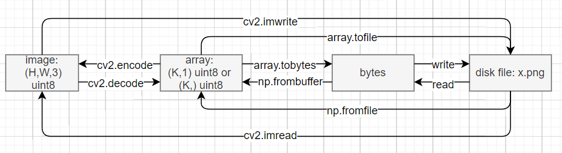

# OpenCV

## opencv-python

### 一般性说明

**安装**

详细可以参考 [opencv-python 仓库](https://github.com/opencv/opencv-python)的 README 文档

```bash
pip install opencv-python  # 无需另外编译安装opencv
```

注意，存在四种使用 pip 的方式进行安装，但只能选择其中的一种，若已经安装了其中的一个，想要安装另一个，则必须将之前的使用 `pip uninstall` 卸载掉。

```bash
pip install opencv-python  # 只包含主要的模块
pip install opencv-contrib-python  # 完整安装：包含主要模块及contrib/extra模块
pip install opencv-python-headless # 包含主要模块，但去除了cv2.imshow这种输出的功能，适用于无图形界面的服务器，体积比opencv-python要小
pip install opencv-contrib-python-headless
```

**导入**

```python
import cv2
```

**注意点**

- `cv2` 包里函数的参数 `size` 一般为 `(width, height)`，表示宽与高。
- `cv2` 使用使用 `numpy` 数组来表示图像，数组的数据类型必须为 `uint8`，即 `dtype=np.uint8`。并且数组的形状为 `channel_last` 的方式，例如：
  - RGB 图像的表示形式是形状为 `(H, W, 3)` 的数组，其中通道的存储顺序为 `BGR`，许多函数例如 `cv2.putText` 拥有参数 `color` 表示颜色，其取值必须为一个整数的三元组，且取值为 `[0, 255]` 区间内的整数，同样遵循 `BGR` 的顺序，例如：`color=(255, 0, 0)` 表示蓝色。
  - 灰度图像的表示形式是形状为 `(H, W)` 的数组

- `cv2` 中的函数对 `numpy`数组进行操作时往往需要 `numpy` 数组的内部存储是 C 连续的，`numpy` 中对数组的某些操作会使得数组变的不是 C 连续的，例如：
  - `np.transpose`
  - 负间隔的切片操作：`arr = arr[::-1,:,:]`

  这种情况下需要首先使用如下方法将 `numpy` 数组转换，再利用 `cv2` 的相关函数对转换后的数组进行操作

  ```
  arr = np.ascontiguousarray(arr)
  ```

- `cv2` 的许多函数是 inplace 的，例如一些绘制图像的函数。例如：

  ```python
  import numpy as np
  import cv2
  image = np.zeros((224, 224, 3), dtype=np.uint8)
  print(image.any())  # False
  # 通常的写法是不需要接收返回值的,此处是为了说明问题
  x = cv2.putText(image, "mark", (100, 200), cv2.FONT_HERSHEY_COMPLEX, 5, (0, 0, 255))
  print(x.any(), image.any(), x is image)  # True, True, True
  ```

  如果不想对原图进行修改，需要首先调用 `numpy` 数组的 `copy` 方法再进行处理，例如：

  ```python
  image = np.zeros((224, 224, 3), dtype=np.uint8)
  print(image.any())  # False
  x = cv2.putText(image.copy(), "mark", (100, 200), cv2.FONT_HERSHEY_COMPLEX, 5, (0, 0, 255))
  print(x.any(), image.any(), x is image)  # True, False, False
  ```

- `cv2` 里许多函数的参数的取值会是“标志位”，例如：`cv2.COLOR_BGR2RGB`，`cv2.LINE_8`，其来源于 `opencv` 的 C++ 源码中所定义的宏，一般用于控制同一接口下的不同算法，这些标志位实际上是一些整数，例如：`cv2.COLOR_BGR2RGB==4`，`cv2.LINE_8==8`。通常情况下推荐使用宏名而不要直接使用它所代表的整数。

### 图像读写操作

详细可参考[官方文档](https://docs.opencv.org/4.5.4/d8/d6a/group__imgcodecs__flags.html#ga61d9b0126a3e57d9277ac48327799c80)

#### `imread` 与 `imwrite`

**cv2.imread**

```python
cv2.imread(filename, flags=cv2.IMREAD_COLOR) -> bool
image = cv2.imread("x.jpg")
```

- cv2.IMREAD_COLOR：得到的图像为 BGR 格式的 `numpy` 数组
- cv2.IMREAD_UNCHANGED：原样解码，例如：若图像原本存储了 `RGBA` 格式的数据，则读出来也会是四通道的 `numpy` 数组
- cv2.IMREAD_GRAYSCALE：得到的图像是形状为 `(H, W)` 的灰度图像
- ...

备注：需要格外注意，若读入不成功，比如文件路径不存在，`image` 将会是 `None`，但该条读入语句并不会报错引起程序中断。

**cv2.imwrite**

```python
cv2.imwrite(filename, img, params=()) -> bool
cv2.imwrite("x.jpg")
```

第三个参数可选，含义如下：

```python
cv2.imwrite("x.jpg", img, (cv2.IMWRITE_JPEG_QUALITY， 95))  # jpg格式默认值
cv2.imwrite("x.png", img, (cv2.IMWRITE_PNG_COMPRESSION, 3))  # png格式默认值
```

- cv2.IMWRITE_JPEG_QUALITY=1：JPEG 格式，0-100 的整数，表示图像质量，默认为 95。
- cv2.IMWRITE_PNG_COMPRESSION=16：PNG 格式，0-9表示压缩级别，级别越高图像越小，默认值为 3。

备注：JPEG 格式为有损压缩；而 PNG 格式为无损压缩，PNG 的压缩级别会影响编码解码时间。

备注：imread 与 imwrite 的返回值若为 True，则表示读入或写入成功，否则表示失败。

#### `imencode` 与 `imdecode`

（可跳到最后直接看总结:smile:）

`imread` 与 `imwrite` 是高级接口，当路径中存在中文字符时，`imread` 与 `imwrite` 会无法读写文件，这种时候可以结合 `numpy` 进行处理：

- 利用低级接口 `imencode` 与 `imdecode` 对数据进行编码与解码
- 文件 IO 操作使用 `numpy` 的相关方法例如 `fromfile`，`tofile` 等方法进行

首先介绍 `imencode` 与 `imdecode` 方法

**cv2.imencode**

```python
cv2.imencode(ext, img, params=()) -> (bool, np.array)
# ext表示扩展名,用于决定压缩方式, img为(H,W[,C])数组,params为压缩参数
# flag=True表示编码成功, encoded_img是一个形状为(K, 1)的uint8数组
flag, encoded_img = cv2.imencode(".jpg", img, (cv2.IMWRITE_JPEG_QUALITY， 95))
```

**cv2.imdecode**

```python
cv2.imdecode(buf, flags) -> np.array
# arr可以是一个(K,)的uint8数组, flags的取值与imread一致
cv2.imdecode(arr, cv2.IMREAD_COLOR)
```

注：此处似乎无需指定按什么方式解码，有些可疑。

```python
x = np.zeros((224, 224, 3))
y = cv2.imdecode(cv2.imencode(".png", x)[1], cv2.IMREAD_UNCHANGED)
(x==y).all()  # True
```


接下来介绍 `numpy` 的相关方法，注意这些方法是与 `cv2` 无关的一套 `numpy` 存储文件的做法。

**np.ndarray.tofile、np.ndarray.tobytes**

`np.ndarray.tofile` 用于将数组存入文件

```python
arr.tofile(path, ...) -> None
arr.tofile("x.png")
```

更细致的写入方式是，先将数组用 `np.tobytes` 转换为字节，再将的得到的字节以二进制形式写入文件

```python
b = cv2.imencode(".png", image)[1].tobytes()
with open("x.png", "wb") as fw:
    fw.write(b)
(cv2.imread("x.png") == image).all()  # True
```

`np.fromfile` 用于读取用 `np.ndarray.tofile` 存入的文件

```python
np.fromfile(path, dtype=np.uint8, ...) -> np.array
arr = np.fromfile("x.jpg", dtype=np.uint8)
```

更细致的读取方式是，先将要读取的文件以二进制形式读取，再将得到的字节用 `np.frombuffer` 得到

```python
with open("x.png", "rb") as fr:
	b = fr.read()
image = cv2.imdecode(np.frombuffer(b, np.uint8), cv2.IMREAD_UNCHANGED)   
```

**总结（太长不看的直接看这里）**

```python
# 写文件, 两种都可以
cv2.imencode(".jpg", image)[1].tofile(path)  # image: (H, W, 3) np.ndarray, uint8, BGR format

b = cv2.imencode(".png", image)[1].tobytes()
with open("x.png", "wb") as fw:
    fw.write(b)
```

```python
# 读文件, 两种都可以
image = cv2.imdecode(np.fromfile(path, dtype=np.uint8), cv2.IMREAD_COLOR)  # image: (H, W, 3) np.ndarray, uint8, BGR format

with open("a.jpg", "rb") as fr:
    b = fr.read()
image = cv2.imdecode(np.frombuffer(b, np.uint8), cv2.IMREAD_UNCHANGED)
```



### RGB 与 BGR 转换（cv2 默认使用 BGR 格式）

```python
# 将srcBGR: uint8数组(H, W, 3)转换为destRGB: uint8数组(H, W, 3)
destRGB = cv2.cvtColor(srcBGR, cv2.COLOR_BGR2RGB)
```

备注：可以调整 `cv2.cvtColor` 函数的第二个参数的取值进行许多其他的转换，例如：

- `cv2.COLOR_BGR2GRAY`：表示将 BGR 图片转换为灰度图片

### 在图像上绘制

详细可参考[官方文档](https://docs.opencv.org/4.5.4/d6/d6e/group__imgproc__draw.html#ga5126f47f883d730f633d74f07456c576)

#### 画点（实际上是在画圈）

```python
cv.circle(img, center, radius, color, thickness=1, lineType=cv2.LINE_8, shift=0)
# center为元组(x, y), radius表示半径, color为三元组(B, G, R), thickness表示线的粗细
cv2.circle(img, (100, 20), 2, (0, 0, 255), thickness=2)
```

备注：

- `lineType`：

#### 添加文字（非英文会乱码）

```python
cv2.putText(image, text, org, font, fontScale, color, thickness=1, lineType=cv2.LINE_8, bottomLeftOrigin=True)
# org是坐标,font是字体,fontScale是字体
# 当bottomLeftOrigin为True时,表示org是文字的左下角坐标,取值为False时表示org为文字的右下角坐标
cv2.putText(image, "mark", (100, 200), cv2.FONT_HERSHEY_COMPLEX, 5, (0, 0, 255), thickness=2, bottomLeftOrigin=True)
```

获取字体大小

#### 添加线、矩形、多边形

**画线段**

```python
cv2.line(img, pt1, pt2, color[, thickness, lineType[, shift]])
# pt1,pt2分别为起点和终点
cv2.line(img, (10, 10), (200, 10), (0, 0, 255))
```

**画矩形**

```python
cv2.rectangle(img, pt1, pt2, color[, thickness[, lineType[, shift]]]) -> img
# pt1, pt2为左上与右下角的坐标
cv2.rectangle(image, (10, 10), (20, 30), (0, 0, 255))
```

**画多边形**

方法一：使用 `cv2.polylines`

```python
# 此函数用于画多个相同b多边形
cv2.polylines(img, pts, isClosed, color[, thickness[, lineType, [shift]]])
# pts 的传参方式很诡异:

# 画一个四边形
# (1)pts可以使用一个长度为1的列表, 列表内为一个(4, 2)形状的数组: [(4, 2)]
# (2)pts也可以使用一个形状为(1, 4, 2)的数组: (1, 4, 2)
pts = np.array([[10, 10], [30, 30], [20, 30], [10, 20]])
cv2.polylines(img, [pts], True, (0, 0, 255))

# 画K个多四边形
# (1)pts可以使用一个长度为K的列表, 列表内为一个(4, 2)形状的数组: [(4, 2),...,(4,2)]
# (2)pts也可以使用一个形状为(K, 4, 2)的数组: (K, 4, 2)
pts = np.array([[[10, 10], [30, 30], [20, 30], [10, 20]],
                [[110, 110], [130, 130], [120, 130], [110, 120]]])
cv2.polylines(img, pts, True, (0, 0, 255))

# 诡异的是 [(4, 1, 2)], [(1, 4, 2)] 这种传法也是对的
```

方法二：使用 `cv2.drawContours`

```python
cv2.drawContours(image, contours, contourIdx, color[, thickness[, lineType[, hierarchy[, maxLevel[, offset]]]]]) -> image
# contours为一个二维数组的列表, 二维数组的形状为(K, 2)
# contoursIdx为一个整数, 表示要画那个, 若取值为-1, 则表示全部画出
contours = np.array([[20, 20], [40, 20], [40, 40], [30, 30], [20, 40]])
cv2.drawContours(image, [contours], 0, (0, 0, 255))
```

### 图像变换

```python
import sklearn.transform as trans
tform = trans.SimilarityTransform()
src = np.array([[100, 100], [200, 50], [200, 200], [100, 150]])
dst = np.array([[60, 70], [80, 70], [80, 100], [60, 100]])
tform.estimate(src, dst)
M = tform.params  # 3*3数组, 最后一行为[0, 0, 1]

src3d = np.ones(3, src.shape[0])
src3d[:-1, :] = src.T
# M @ src3d ~= dst
# M = 
# [[a0, -b0, a1],
#  [b0,  a0,  b1],
#  [0,   0,   1]]
```

变换公式为（`tform.estimate` 实际上就是在估计 `M`）：
$$
\begin{align}
dst_x &= a_0*src_x-b_0*src_y+a_1\\
&=s*[src_x*cos(\theta)-src_y*sin(\theta)]+a_1\\
dst_y &= b_0*src_x+a_0*src_y+b_1\\
&=s*[src_x*sin(\theta)+src_y*cos(\theta)]+b_1
\end{align}
$$
即：
$$
\begin{bmatrix}
dst_x\\dst_y\\0
\end{bmatrix}
=
\begin{bmatrix}
a_0&-b_0&a_1\\
b_0&a_0&b_1\\
0&0&1
\end{bmatrix}
\begin{bmatrix}
src_x\\src_y\\0
\end{bmatrix}
$$
#### cv2 图像旋转（待补充）

### 图像修复

cv2.inpaint

## OpenCV C++ API

### 安装：windows VS2017 + OpenCV C++

https://sevenold.github.io/2019/01/opencv-setup/

## Tricks and Discussion and Have Fun

### 找不到关于 opencv-python 的准确接口文档

似乎的确是没有:cry:，目前能找到的只是官方的[python-tutorial](https://docs.opencv.org/4.5.4/d9/df8/tutorial_root.html)，以及 C++ 接口文档里附上的关于python接口的简要说明。

